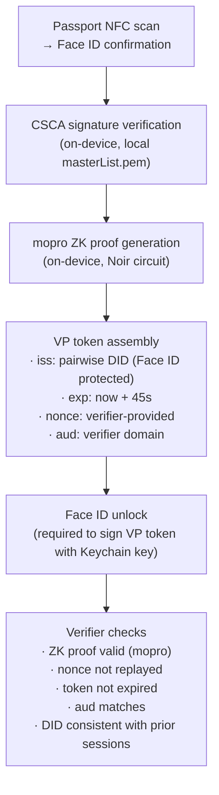

# Advanced Capabilities

Two forward-looking topics: what groups unlock, and how close Solidarity can get to "only-device-can-generate" proofs.

---

## Groups: What They Enable

Solidarity already ships Semaphore group infrastructure (CloudKit sync, Merkle tree, membership proofs). The following capabilities become possible as the group system matures.

### Privacy-Preserving Membership Proofs

The core primitive: prove "I am a member of group G" without revealing which member you are.

```
Current: count verified contacts
Future:  ZK proof of "member of Trust Circle group"
         → no identity revealed
         → group root on-chain or in CloudKit
```

### Sybil-Resistant Voting (Quadratic Funding)

Combining passport ZKP (unique human) with group membership ZKP:

```
Proof: "I am a unique human (passport ZKP) AND member of voting group"
Result: 1 person = 1 vote, Sybil-resistant
Aggregation: collect N proofs → compute quadratic formula
```

**Dependencies**: group membership ZKP (already in `SemaphoreGroupManager`) + proof aggregation service (not yet implemented)

### Time-Locked Social Recovery Enhancement

Guardians already use Shamir SSS. Groups can bind guardian eligibility to group membership:

```
Recovery condition: "any 3 members of guardian-group can unlock"
Group changes: add/remove guardians by updating group Merkle root
No guardian identity revealed during recovery
```

**Dependencies**: low effort — existing Shamir + Semaphore; needs binding logic in `SocialRecoveryService`

### Decentralized Access Control

```
Use case: "Unlock time capsule if 3 trusted contacts approve"
Use case: "Access document only if you hold valid group membership"

Implementation:
  1. Encrypt resource with symmetric key
  2. Key release requires N valid Semaphore proofs from group members
  3. Each prover proves membership without revealing identity
```

### Context-Aware Selective Disclosure

```
Current SD: "share email but not phone" (pre-configured globally)
Future SD:  "share email only to members of Verified Vendors group"

Implementation:
  1. Recipient presents Semaphore proof of group membership
  2. Sender's app checks group membership before revealing field
  3. Different disclosure policy per group
```

**Dependencies**: policy engine for group-conditional sharing (not yet designed)

### Cross-Group Hierarchies

```
Team A ⊂ Department B ⊂ Company C

Proving "I am in Team A" implicitly proves membership of Dept B and Company C
via nested Merkle root binding.
```

**Dependencies**: Merkle tree redesign for nesting (high effort)

### Capability Feasibility

| Capability | Effort | Key Dependencies |
|-----------|--------|-----------------|
| Enhanced social recovery | Low | Shamir + Semaphore binding |
| Sybil-resistant voting | Medium | Proof aggregation service |
| Time-locked recovery | Low | Already mostly there |
| Context-aware disclosure | Medium | Policy engine |
| Decentralized access control | Medium | Key-release protocol |
| Cross-group hierarchies | High | Merkle tree redesign |

---

## Gov + NFC: Device-Binding Architecture

### The Problem

NFC passport chips are not device-bound. Any device that reads the same passport chip and runs the same Noir circuit will produce an equivalent ZK proof. The proof does not cryptographically prove "this specific device generated this."

### What Solidarity Does Today

| Claim | Reality |
|-------|---------|
| Proof generated on-device | ✅ mopro runs locally, no network |
| No PII leaves device | ✅ only ZK proof + public signals transmitted |
| Raw passport data never uploaded | ✅ SOD not transmitted |
| Cannot replay same proof | ✅ 45-second VP token window + nonce |
| Proof bound to specific device | ⚠️ bound to DID key, not hardware |
| Only this device can re-generate | ❌ anyone with same passport can re-scan |

### Achieved: Binding to DID Key

```
Each VP token is signed with a pairwise DID (ECDSA P-256 Keychain key).
The DID key is protected by Face ID.
A verifier can confirm: "This proof was signed by the holder of DID X,
which required Face ID to unlock."

Limitation: DID ≠ hardware. If the Keychain key were extracted,
the device-binding claim collapses.
```

**Code**: [`solidarity/Services/Identity/OID4VPPresentationService.swift`](https://github.com/p2p-solidarity/solidarity/blob/main/solidarity/Services/Identity/OID4VPPresentationService.swift)

### What Would Be Needed for True Hardware Binding

True hardware binding requires the NFC chip to authenticate directly with the device's Secure Enclave. This is defined in ICAO 9303 Part 12 (EAC Extended Access Control), but support is not yet widespread among issuing countries.

```
Theoretical flow (EAC-3 device binding):
1. Passport chip issues a Device Binding Certificate
2. Chip signs a challenge from device's Secure Enclave
3. ZK proof inputs include the Secure Enclave signature
4. Verifier: "Proof was generated on the specific device whose
             Secure Enclave signed the chip challenge"

Status: Not feasible without government-level standardization
```

### Practical Architecture (What Can Be Done Now)

The following measures together provide strong practical device-binding without hardware EAC:



**Effective guarantees**:
1. Proof requires physical passport (NFC read)
2. Proof requires Face ID on the same device (Keychain key)
3. Proof expires in 45 seconds (no stockpiling)
4. Each RP sees a different DID (no cross-RP replay)
5. Nonce prevents replay within a session

### Limits That Cannot Be Closed Without Hardware Support

| Limitation | Root Cause |
|-----------|-----------|
| Different device, same passport → same proof | NFC chip has no device-binding |
| Device compromise (Keychain extraction) | Software-level key protection only |
| Offline proof replay (within 45s window) | By design — tradeoff for offline operation |

### Recommendation

For the current use cases (age verification, event check-in, humanhood proof), the 45s nonce + pairwise DID architecture provides sufficient device-binding. If higher assurance is required in the future, consider:

1. **Biometric re-confirmation per session**: already implemented (Face ID required for each VP presentation)
2. **Short validity window tightening**: reduce from 45s to 15s for higher-stakes verifiers
3. **Monitor ICAO EAC-3 adoption**: as countries roll out device-binding passport chips, integrate the Secure Enclave attestation into the Noir circuit inputs
