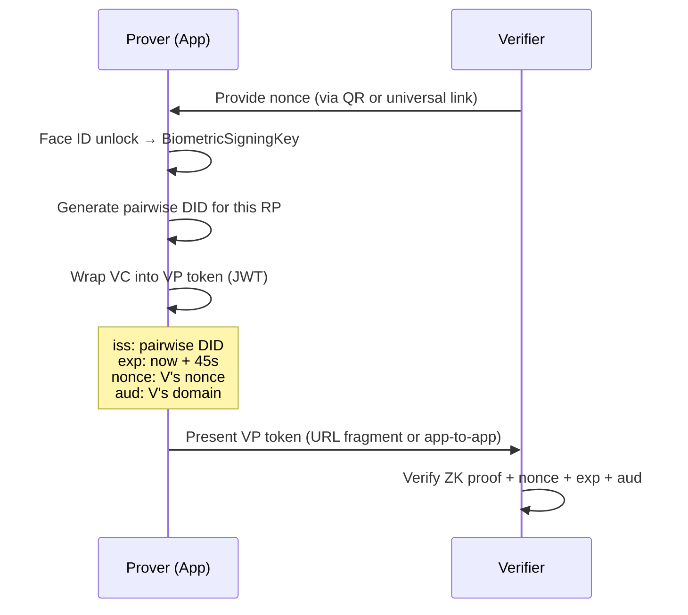

# Data Exchange Model

Three questions in one place: what does sharing send, where does OIDC fit, and what does each party actually receive.

---

## What Me / Share Sends

Sharing has three paths. Each sends a different payload.

### Path A — Proximity (MultipeerConnectivity)

The richest exchange. Both parties send and receive simultaneously.

```swift
// solidarity/Services/Sharing/ProximityPayload.swift
struct ProximityPayload: Codable {
    // Card content
    let cardFields: [String: String]      // filtered by pre-configured selective disclosure

    // Identity
    let senderDID: String                 // did:key:z6Mk... (EC P-256 public key)
    let timestamp: Date

    // ZK / group proofs (optional)
    let issuerCommitment: String?         // Semaphore commitment if group-enabled
    let issuerProof: Data?                // Semaphore group membership proof
    let sdProof: Data?                    // SelectiveDisclosureProof (field commitments + signature)

    // Cryptographic binding
    let payloadSignature: Data            // ECDSA P-256 over {cardFields, senderDID, timestamp}

    // Secure messaging keys (optional, if device supports Sakura)
    let sealedRoute: Data?
    let pubKey: Data?                     // X25519 encryption key
    let signPubKey: Data?                 // Ed25519 signing key
}
```

**Available card fields**: `name`, `email`, `phone`, `company`, `title`, `socialNetworks`, `skills`

**Pre-configured, not per-exchange**: the field selection is set in Settings → Sharing once and reused for all exchanges. The [Edit Card ✎] button in [EX-2] is an escape hatch, not the default path.

### Path B — QR Code (Static)

One-way. The sharer generates a QR; the scanner receives but does not reply.

The app discriminates QR format via a priority router in `QRCodeScanService.process()`. Formats are identified in this order:

```
1. openid4vp://...           → OID4VP proof request (no contact created)
2. vp_token (VP JWT)         → Proof presentation / optional VC import
3. eyJ...  (bare JWT, 3 seg) → DID-signed card (bare JWT, no envelope)
4. JSON { format: ... }      → QRCodeEnvelope → route by format field:
     plaintext               → Plain card (no crypto)
     zkProof                 → Encrypted payload + Semaphore/SD proof
     didSigned               → VC JWT envelope
5. Base64 blob               → Legacy encrypted payload
```

**Three envelope formats and what they produce:**

| Format | Payload | Verification | `verificationStatus` |
|--------|---------|-------------|----------------------|
| `plaintext` | Card snapshot, expiry | None (no crypto) | `.unverified` always |
| `zkProof` | Encrypted `QRSharingPayload`; may carry `issuerCommitment + issuerProof` (Semaphore) and/or `sdProof` (SD age proof) | Semaphore issuer proof + SD proof if present | `.verified` only if issuer verified AND all claims satisfied; otherwise `.unverified` or `.failed` |
| `didSigned` | VC JWT (W3C VC) | `VCService.importPresentedCredential()` → full JWT signature + trust anchor check | `.verified` / `.unverified` / `.failed` from stored credential status |

**openid4vp** does not create a `ContactEntity` at all — it returns a `ScanRoute.oid4vpRequest()` which triggers the proof presentation UI.

**Privacy guarantee for VP QR**: the vp_token is in the URL fragment (`#`), so it never reaches the server at `verify.solidarity.app`.

```
https://verify.solidarity.app/p/{proof_id}#{vp_token}
                                           ↑
                            Fragment: server never sees this
```

### Path C — Apple Wallet Pass

Solidarity assembles and signs a `.pkpass` locally. Only SHA256 hashes of the manifest files are sent to the Cloudflare Worker for signing — no card content ever leaves the device in plaintext.

```
Device:
  1. Assemble pass.json (card fields + QR code linking back to app)
  2. Compute SHA256 hashes of all pass files → manifest.json
  3. POST {manifest_hash} to Cloudflare Worker
  4. Worker signs with Apple's PassKit certificate (PKCS#7 detached signature)
  5. Device assembles final .pkpass bundle

Receiver scans QR in pass → app deep-link → contact import
```

---

## Where OIDC Is Used

### OID4VP (Presentation) — Fully Implemented

Used when proving age or humanhood to a verifier. The prover generates a VP token and presents it via Smart QR.



**Data shared in VP token**:

```json
{
  "iss": "did:key:z6Mk...",
  "iat": 1710000000,
  "exp": 1710000045,
  "nonce": "verifier-provided-nonce",
  "aud": "https://bar-abc.example.com",
  "vp": {
    "holder": "did:key:z6Mk...",
    "verifiableCredential": ["<VC JWT>"]
  }
}
```

Each VC contains **only derived claims** — no PII:
- `age_over_18: true` (no date of birth)
- `is_human: true` (no name)
- `nationality: "TWN"` (optional, user-controlled)

**Cross-RP privacy**: each RP receives a different pairwise DID. No two RPs can correlate the same user.

**Code**: [`solidarity/Services/Identity/OID4VPPresentationService.swift`](https://github.com/p2p-solidarity/solidarity/blob/main/solidarity/Services/Identity/OID4VPPresentationService.swift)

### OID4VCI (Issuance) — Framework Only, Not Integrated

`CredentialIssuanceService.swift` and `OIDCTokenService.swift` implement the pre-authorized code flow skeleton:

- Token endpoint request (`grant_type: urn:ietf:params:oauth:grant-type:pre-authorized_code`)
- User PIN support (optional)
- Credential request signing (stub — incomplete)

This is not connected to any issuer and is not reachable from the main app flow. It is infrastructure for a future institutional credential onboarding flow.

---

## What Each Party Gets: Proximity vs QR

### Proximity Exchange (Bidirectional)

Both parties end up with a `ContactEntity` that contains:

```
ContactEntity {
  businessCard       → filtered card fields from the other person
  source             → .proximity
  verificationStatus → .verified      ← Face ID was used on both sides
  didPublicKey       → sender's DID public key
  exchangeSignature  → ECDSA signature over the card payload
  myExchangeSignature → my own signature (for graph export)
  exchangeTimestamp  → exact time of exchange
  myEphemeralMessage → what I wrote (locked after send)
  theirEphemeralMessage → what they wrote (real-time delivery)
  sealedRoute        → encrypted messaging route (if Sakura supported)
  pubKey             → X25519 encryption key (if present)
  signPubKey         → Ed25519 signing key (if present)
  graphExportEdgeId  → edge ID for Graph Credential
}
```

The contact is added to the Social Graph hash set (SHA256 of DID) for future common-friends intersection.

### QR Code Scan (One-way)

All QR formats share `source = .qrCode`. What differs is which fields are populated and what `verificationStatus` is set to.

```
ContactEntity {
  source             → .qrCode  (always)
  businessCard       → from payload (all formats)
  receivedAt         → current date (all formats)
  sealedRoute        → from payload (plaintext / zkProof only)
  pubKey             → nil  (never populated via QR)
  signPubKey         → nil  (never populated via QR)
  exchangeSignature  → nil  (no mutual exchange)
  ephemeralMessages  → nil  (no live session)
  credentialId       → set only for didSigned / VP token import
}
```

QR contacts are **not** included in the Social Graph intersection hash set until a reciprocal proximity exchange happens.

---

### Comparison: Proximity vs Each QR Format

| Field | Proximity | QR: plaintext | QR: zkProof | QR: didSigned | QR: openid4vp |
|-------|-----------|---------------|-------------|---------------|----------------|
| **ContactEntity created** | ✅ | ✅ | ✅ | ✅ | ❌ proof UI only |
| **source** | `.proximity` | `.qrCode` | `.qrCode` | `.qrCode` | — |
| **Card fields** | filtered (pre-configured SD) | from snapshot | from `QRSharingPayload` | extracted from VC JWT | — |
| **verificationStatus** | `.verified` (mutual Face ID) | `.unverified` always | `.verified` if issuer + claims pass; else `.unverified` / `.failed` | `.verified` / `.unverified` / `.failed` from VC validation | `.pending` → no contact |
| **DID public key stored** | ✅ sender's DID | ❌ | ❌ | ❌ (VC issuer DID tracked separately) | — |
| **Payload signature verified** | ✅ ECDSA P-256 | ❌ | ✅ Semaphore issuer proof + SD proof (if present) | ✅ VC JWT signature | ✅ ZK proof (no contact) |
| **credentialId stored** | ❌ | ❌ | ❌ | ✅ `StoredCredential.id` | — |
| **sealedRoute** | ✅ (if Sakura supported) | ✅ from payload | ✅ from payload | ❌ | — |
| **pubKey / signPubKey** | ✅ (if Sakura supported) | ❌ | ❌ | ❌ | — |
| **Ephemeral message** | ✅ real-time via MCSession | ❌ | ❌ | ❌ | — |
| **Graph intersection** | ✅ immediate | ❌ until proximity | ❌ until proximity | ❌ until proximity | — |
| **Semaphore proof** | ✅ (if sender has group) | ❌ | ✅ optional in payload | ❌ | — |

**Key takeaways**:
- Only `didSigned` can produce a **`.verified`** contact from a QR scan — but only if the VC JWT validates against the stored credential trust chain.
- `plaintext` is always `.unverified` by design; no cryptographic assertion is made.
- `zkProof` reaches `.verified` only when the Semaphore issuer proof passes AND any claimed fields (e.g. `age_over_18`) are satisfied — missing either drops it to `.unverified` or `.failed`.
- `openid4vp` skips the contact store entirely; it drives the proof-presentation UI and exits.

**Code**: [`solidarity/Services/Card/QRCodeScanService+Handlers.swift`](https://github.com/p2p-solidarity/solidarity/blob/main/solidarity/Services/Card/QRCodeScanService+Handlers.swift), [`solidarity/Services/Card/QRCodeScanService+Verification.swift`](https://github.com/p2p-solidarity/solidarity/blob/main/solidarity/Services/Card/QRCodeScanService+Verification.swift)
