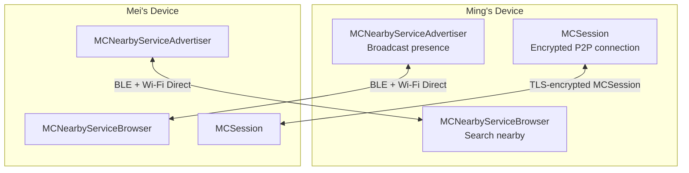
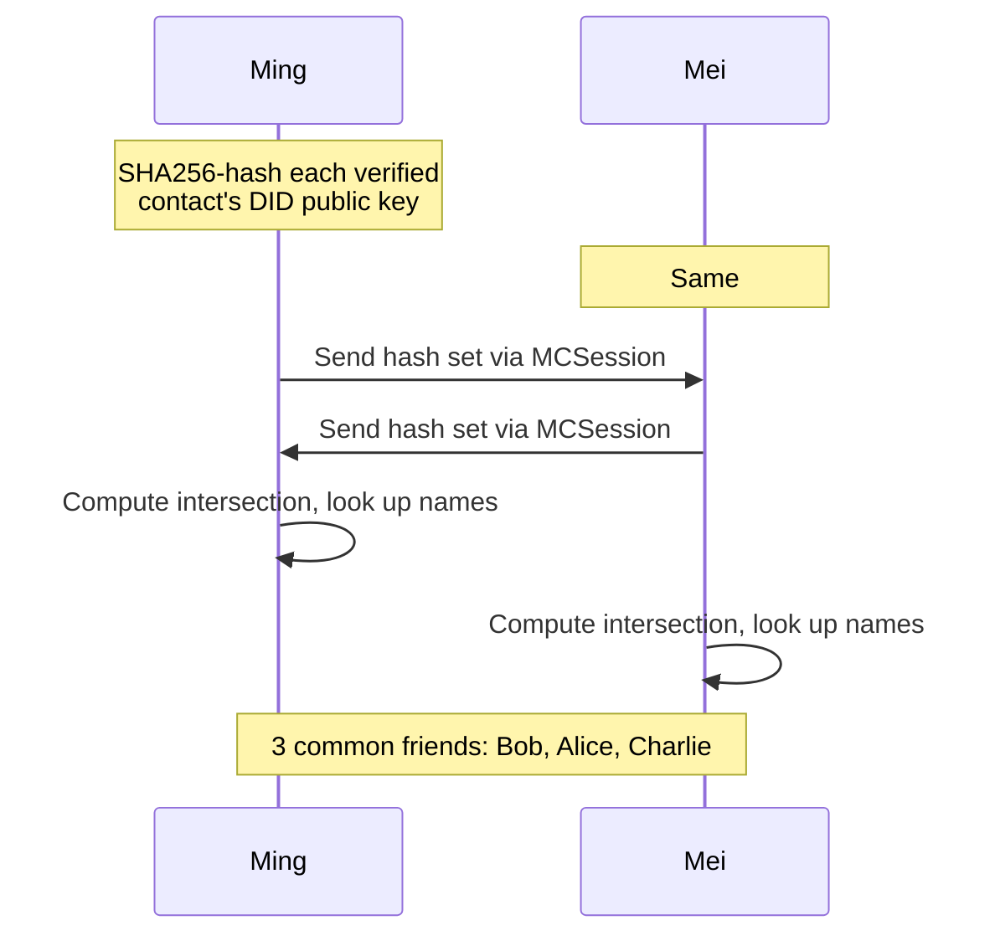
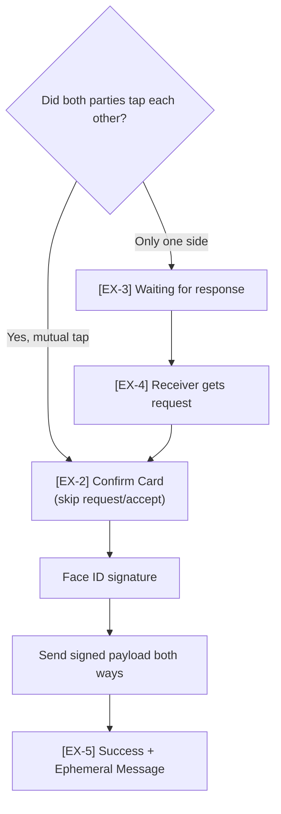
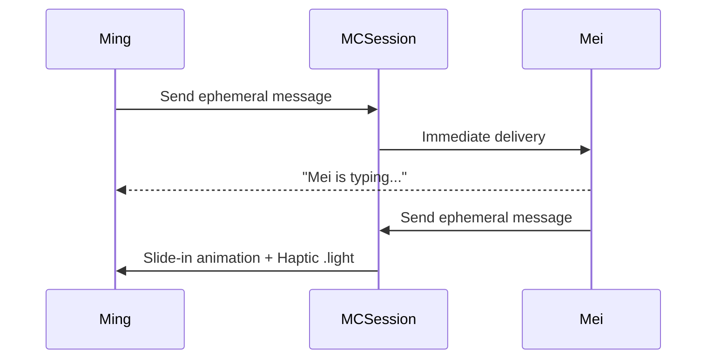
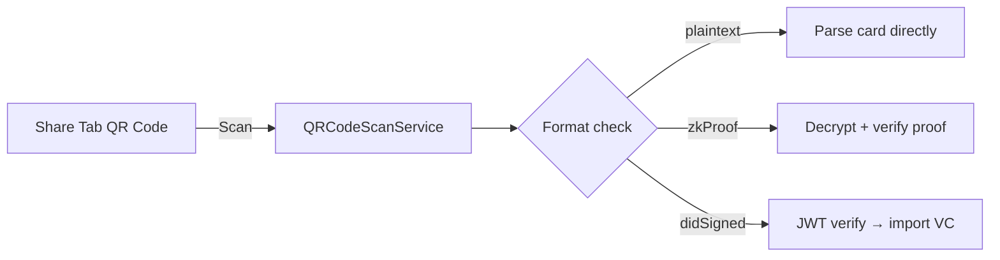

# P2P Networking

Solidarity uses Apple's **MultipeerConnectivity** framework for face-to-face P2P proximity networking. No internet connection required for:
- Discovering nearby Solidarity users
- Computing common friends (Social Graph Intersection)
- Exchanging cryptographically signed cards
- Real-time ephemeral message delivery

---

## Architecture Overview



**Key properties**:
- Both advertise and browse simultaneously (symmetric peers)
- Works over BLE + Wi-Fi Direct — no internet
- Supports up to 8 concurrent peers in discovery

**Code**: [`solidarity/Services/Sharing/ProximityManager.swift`](https://github.com/p2p-solidarity/solidarity/blob/main/solidarity/Services/Sharing/ProximityManager.swift)

---

## Discovery Flow

```swift
// solidarity/Services/Sharing/ProximityManager.swift

class ProximityManager: NSObject {
    let serviceType = "solidarity-p2p"

    func startDiscovery() {
        advertiser.startAdvertisingPeer()
        browser.startBrowsingForPeers()
    }

    // After connection, run Social Graph Intersection handshake
    func session(_ session: MCSession, peer: MCPeerID,
                 didChangeState state: MCSessionState) {
        if state == .connected {
            performGraphIntersectionHandshake(with: peer)
        }
    }
}
```

---

## Social Graph Intersection (Common Friends)

After MCSession is established, both sides perform an automatic common friends handshake:



**Privacy design**:
- Only SHA256 hashes are exchanged, never raw contact data
- Intersection is computed locally
- Only matching hashes can be identified — no inference of other contacts

**Code**: [`solidarity/Services/SocialGraph/`](https://github.com/p2p-solidarity/solidarity/tree/main/solidarity/Services/SocialGraph)

---

## Exchange Payload

The payload transmitted during face-to-face exchange:

```swift
// solidarity/Services/Sharing/ProximityPayload.swift
struct ProximityPayload: Codable {
    // Card fields (filtered by selective disclosure settings)
    let cardFields: [String: String]

    // Identity
    let senderDID: String               // did:key:z6Mk...
    let timestamp: Date

    // ZK-related
    let issuerCommitment: String?       // Semaphore commitment (if enabled)
    let issuerProof: Data?              // Semaphore issuer proof
    let sdProof: Data?                  // SelectiveDisclosureProof

    // Cryptographic signature
    let payloadSignature: Data          // ECDSA P-256 signature

    // Secure messaging (if supported)
    let sealedRoute: Data?
    let pubKey: Data?
    let signPubKey: Data?
}
```

**Signed content**: `{ cardFields, senderDID, timestamp }` — signed with EC P-256 Keychain private key.

---

## Mutual Tap Fast Path



---

## Ephemeral Message Real-Time Delivery

After successful exchange, both parties send messages via the same MCSession in real time:



Message delivery cases:
- EX-5 screen still open → displayed immediately
- EX-5 already dismissed → shown in PL-2 Person Detail

MCSession disconnect after → message may be lost → toast "Connection lost, ephemeral message may not have been delivered"

**Code**: [`solidarity/Services/Sharing/ProximityManager+SessionDelegate.swift`](https://github.com/p2p-solidarity/solidarity/blob/main/solidarity/Services/Sharing/ProximityManager+SessionDelegate.swift)

---

## Received Payload Verification

Before saving to Contact store, the receiver verifies:

1. `payloadSignature` — ECDSA P-256 verify using sender's DID public key
2. `issuerProof` (if present) — Semaphore proof scope/signal/root binding
3. `sdProof` (if present) — SelectiveDisclosureProof signature and expiry

**Code**: [`solidarity/Services/Sharing/ProximityManager+SessionDelegate.swift`](https://github.com/p2p-solidarity/solidarity/blob/main/solidarity/Services/Sharing/ProximityManager+SessionDelegate.swift)

---

## Error Handling

| Scenario | Behavior |
|----------|----------|
| Bluetooth off | "Please enable Bluetooth" + [Settings] |
| Wi-Fi off | Still works (BLE), "Enable Wi-Fi for faster discovery" |
| 30s no peers found | "No Solidarity users found nearby" + [Try Again] |
| Disconnect before EX-5 | "Connection lost", exchange failed |
| Disconnect after EX-5 | Card exchanged, ephemeral message may be lost |
| Peer declines | "Mei declined the exchange" + [OK] |

---

## QR Code Sharing (Offline Fallback)

When P2P is unavailable, QR code static sharing also works:



Key differences between QR and Proximity:
- QR typically only carries the card body, not `pubKey/signPubKey` (no Sakura secure messaging)
- Proximity carries full messaging key material
- Both include `payloadSignature` verification

**Code**:
- [`solidarity/Services/Card/QRCodeScanService+Handlers.swift`](https://github.com/p2p-solidarity/solidarity/blob/main/solidarity/Services/Card/QRCodeScanService+Handlers.swift)
- [`solidarity/Models/Contact.swift`](https://github.com/p2p-solidarity/solidarity/blob/main/solidarity/Models/Contact.swift) (`canReceiveSakura` field)
