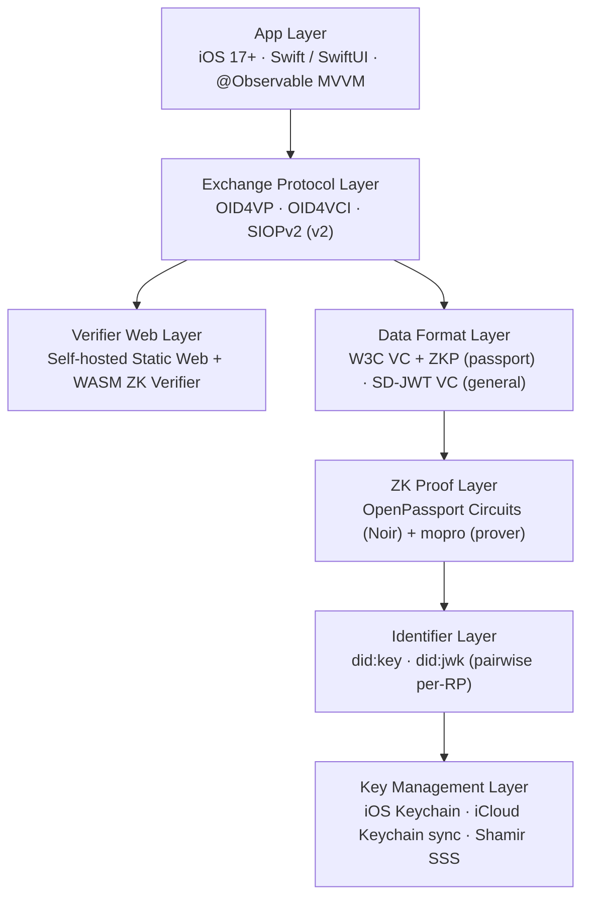

# Architecture

Solidarity's architecture is built on three core principles: **local-first**, **privacy-first**, and **open standards**.

## Architecture Layers

---

## Sections

### [Technology Stack](/architecture/tech-stack)

Full tech stack, SDK selection, data persistence strategy.

**Highlights**: iOS 17.0+, SwiftData, MultipeerConnectivity, PassKit

### [Zero-Knowledge Proofs](/architecture/zero-knowledge)

Passport ZKP pipeline (MRZ → NFC → mopro → VC) and verification flow.

**Highlights**: OpenPassport Noir circuit, mopro prover, SD-JWT fallback, WASM Web Verifier

### [P2P Networking](/architecture/p2p-networking)

Face-to-face exchange technical implementation: MultipeerConnectivity, Social Graph Intersection, encrypted payload.

**Highlights**: MCNearbyServiceAdvertiser/Browser, hash-based common friends, signed exchange payload

### [Key Management & Privacy](/architecture/privacy)

DID key lifecycle, iCloud Keychain sync, Social Recovery (Shamir SSS).

**Highlights**: EC P-256 keys, pairwise per-RP keys, Shamir + ECIES guardian encryption

### [Apple Wallet (Pass Signing)](/architecture/pass-signing)

Apple Wallet `.pkpass` integration: local assembly + Cloudflare Worker signing.

**Highlights**: PassKit, PKCS#7 detached signature, stateless backend

---

## In-Depth Analysis

### [Verification Model](/architecture/verification-model)

What data is actually verified, at which trust level, and by which mechanism — signatures, CSCA chain, ZK proof, expiry, nonce.

**Highlights**: CSCA passive auth, VP token checks, P2P payload verification, what is NOT verified

### [Data Exchange Model](/architecture/data-exchange)

What Me/Share sends on each path, where OID4VP and OID4VCI fit, and the exact difference between Proximity and QR code contacts.

**Highlights**: ProximityPayload fields, VP token data, OIDC flow status, ContactEntity comparison

### [Wallet Architecture](/architecture/wallet-positioning)

Precise boundaries of Solidarity as a VC Wallet, VP Wallet, and Apple Wallet integration.

**Highlights**: what is complete vs stub, accurate product positioning

### [Advanced Capabilities](/architecture/advanced-capabilities)

Group-based features enabled by Semaphore, and the architecture for Gov+NFC device-binding.

**Highlights**: Semaphore group use cases, pairwise DID binding, EAC-3 hardware binding limitations

---

## Quick Reference

| Feature | Technology | Code Location |
|---------|-----------|---------------|
| Proximity discovery | MultipeerConnectivity | [`Services/Sharing/ProximityManager.swift`](https://github.com/p2p-solidarity/solidarity/blob/main/solidarity/Services/Sharing/ProximityManager.swift) |
| QR generation | CoreImage + JWT | [`Services/Card/QRCodeGenerationService.swift`](https://github.com/p2p-solidarity/solidarity/blob/main/solidarity/Services/Card/QRCodeGenerationService.swift) |
| Passport NFC reading | NFCPassportReader | [`Services/Identity/NFCPassportReaderService.swift`](https://github.com/p2p-solidarity/solidarity/blob/main/solidarity/Services/Identity/NFCPassportReaderService.swift) |
| ZK proof generation | mopro + Noir | [`Services/ZK/MoproProofService.swift`](https://github.com/p2p-solidarity/solidarity/blob/main/solidarity/Services/ZK/MoproProofService.swift) |
| VC/VP wrapping | OID4VP | [`Services/Identity/OID4VPPresentationService.swift`](https://github.com/p2p-solidarity/solidarity/blob/main/solidarity/Services/Identity/OID4VPPresentationService.swift) |
| Apple Wallet | PassKit | [`Services/Sharing/PassKitManager.swift`](https://github.com/p2p-solidarity/solidarity/blob/main/solidarity/Services/Sharing/PassKitManager.swift) |
| Key management | iOS Keychain | [`Services/Identity/`](https://github.com/p2p-solidarity/solidarity/tree/main/solidarity/Services/Identity) |
| Local storage | SwiftData | [`Models/`](https://github.com/p2p-solidarity/solidarity/tree/main/solidarity/Models) |
