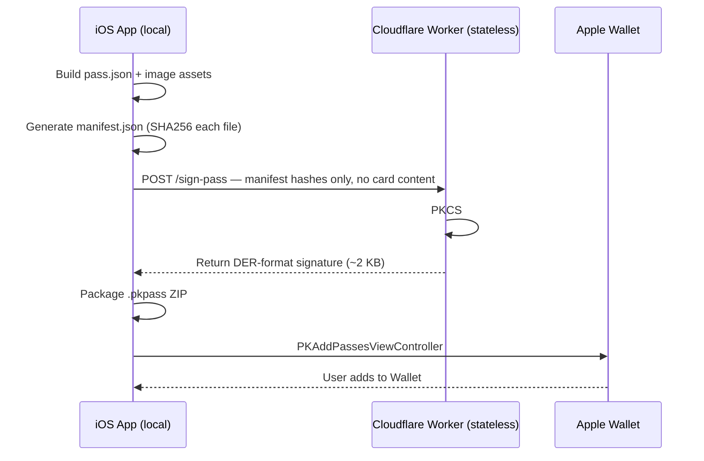

# Apple Wallet (Pass Signing)

Solidarity supports adding business cards to Apple Wallet (`.pkpass` format), giving users quick access to their card QR code from the lock screen.

---

## Architecture



**Privacy guarantee**: The Cloudflare Worker receives only SHA256 hashes — never card content or personal data. No database, no logs, stateless.

---

## iOS Implementation

```swift
// solidarity/Services/Sharing/PassKitManager.swift
// solidarity/Services/Sharing/PassKitManager+Generation.swift

func createSignedPass(for card: BusinessCard) async throws -> Data {
    // 1. Build pass bundle files
    let passJSON = createPassJSON(card)

    // 2. Generate manifest (SHA256 hashes)
    let manifest = [
        "pass.json": passJSON.sha256(),
        "icon.png":  iconData.sha256(),
        "logo.png":  logoData.sha256()
    ]
    let manifestJSON = try JSONEncoder().encode(manifest)

    // 3. Request signature from Cloudflare Worker (hashes only)
    let signature = try await signManifest(manifestJSON)

    // 4. Package .pkpass ZIP
    return try createPassBundle(
        passJSON: passJSON,
        manifest: manifestJSON,
        signature: signature
    )
}
```

---

## Cloudflare Worker Signing Service

The Worker receives the manifest hashes and produces a PKCS#7 detached signature using the Apple Pass certificate:

```typescript
// src/routes/passkit/sign.ts
async function signPass(manifestJson: string, env: Env) {
    // Certificates loaded from Cloudflare encrypted secrets
    const passCertPem = Buffer.from(env.PASS_CERT, "base64").toString("utf-8");
    const passKeyPem  = Buffer.from(env.PASS_KEY,  "base64").toString("utf-8");
    const wwdrCertPem = Buffer.from(env.WWDR_CERT, "base64").toString("utf-8");

    // PKCS#7 detached signature (PassKit requires SHA-1 for the signed-data digest)
    const p7 = forge.pkcs7.createSignedData();
    p7.content = forge.util.createBuffer(manifestJson, "utf8");
    // ... attach certificates and sign
    p7.sign({ detached: true });

    return p7.toAsn1(); // DER format
}
```

---

## Pass Format

The QR barcode embedded in the Apple Wallet pass contains an app import URL, so anyone who receives the pass can scan it to import the contact into Solidarity.

**Capabilities**:
- Card info (name, company, email) displayed in Wallet
- QR code scannable for contact import
- Lock screen quick access
- NFC tap support (iPhone XS+)

**Limitations**:
- Signing requires a network call to `/sign-pass`
- Revocation is local-only — no server-driven revocation

---

## Certificate Setup

Apple Pass signing requires:
1. Apple Developer Pass Type ID Certificate (`pass.p12`)
2. Apple WWDR G4 Certificate

Certificates are base64-encoded and stored as Cloudflare encrypted secrets:
- `PASS_CERT` — Pass signing certificate
- `PASS_KEY` — Private key
- `WWDR_CERT` — Apple WWDR G4

**Code**:
- [`solidarity/Views/CardViews/WalletPassGenerationView.swift`](https://github.com/p2p-solidarity/solidarity/blob/main/solidarity/Views/CardViews/WalletPassGenerationView.swift)
- [`solidarity/Services/Sharing/PassKitManager.swift`](https://github.com/p2p-solidarity/solidarity/blob/main/solidarity/Services/Sharing/PassKitManager.swift)
- [`solidarity/Services/Sharing/PassKitManager+Generation.swift`](https://github.com/p2p-solidarity/solidarity/blob/main/solidarity/Services/Sharing/PassKitManager+Generation.swift)
