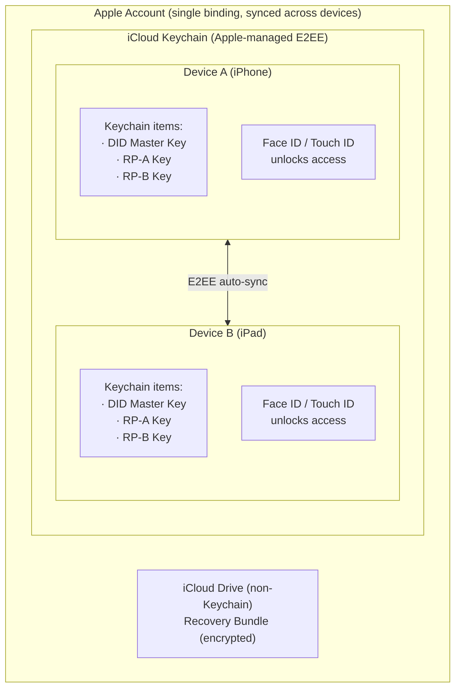
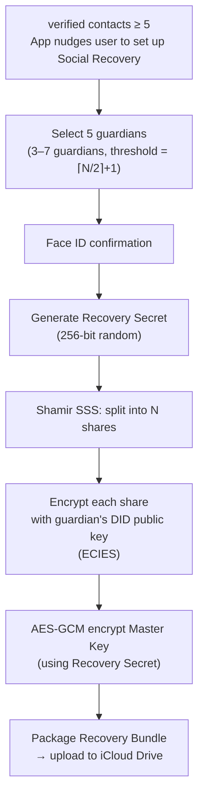
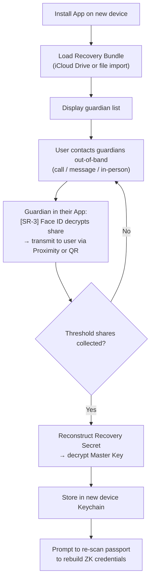

# Key Management & Privacy

**Core principle**: Users never touch private keys, seed phrases, or any cryptographic details. All key management relies entirely on native iOS capabilities (Keychain + iCloud Keychain). "Face ID is your identity."

---

## Architecture



---

## Key Lifecycle

| Stage | Behavior | Technology |
|-------|----------|------------|
| **Creation** | EC P-256 key pair generated in Keychain on first launch | `SecKeyCreateRandomKey` with `.biometryCurrentSet` |
| **Protection** | Any private key access requires Face ID / Touch ID | `kSecAttrAccessibleWhenUnlocked` (allows iCloud sync) |
| **Sync** | iCloud Keychain auto-syncs E2EE to all devices on the same Apple Account | Native Apple mechanism, no custom sync needed |
| **Use** | Each DID operation requires Face ID unlock | Face ID → Keychain access → `SecKeyCreateSignature` |
| **Pairwise** | A separate key pair is generated in Keychain for each RP | One independent `SecKey` per RP |
| **Backup** | Apple manages E2EE backup for iCloud Keychain | No user action required |
| **Recovery (normal)** | Sign in to same Apple Account → Keychain auto-syncs | Handles device migration naturally |
| **Recovery (disaster)** | Social Recovery → Shamir → reconstruct Master Key | See Social Recovery below |

---

## Pairwise DID (Per-RP Key Pair)

Each Verifier (RP) uses a separate key pair, making it impossible to correlate the user's identity across RPs:

```
Keychain
  ├─ "solidarity.master"         → Master Key Pair → did:key
  │   Used for: VC self-issuance, face-to-face exchange
  │
  ├─ "solidarity.rp.bar-abc.com" → RP-A Key Pair → did:key
  │   Used for: presenting proof to Bar ABC
  │
  ├─ "solidarity.rp.example.com" → RP-B Key Pair → did:key
  │   Used for: login to example.com
  │
  └─ ... one independent key pair per RP
```

**Why independent generation instead of derivation**: iOS Secure Enclave does not allow exporting raw key material, so HKDF derivation is not possible. Generating an independent key pair per RP is simpler, more secure, and all key pairs are automatically synced via iCloud Keychain.

---

## DID Format

```
did:key:z6Mk...  (EC P-256 public key → multicodec → multibase)
```

The App UI never surfaces the `did:key:z6Mk...` string directly. It is referred to as "your digital identity." DID details are accessible under Settings → Advanced.

**Code**: [`solidarity/Services/Identity/DIDKeyService.swift`](https://github.com/p2p-solidarity/solidarity/blob/main/solidarity/Services/Identity/DIDKeyService.swift)

---

## Social Recovery (Shamir Secret Sharing)

### Concept

Shamir's Secret Sharing splits the DID Master Key recovery secret into N shares, encrypts each share for a guardian, and stores them in a Recovery Bundle. In a disaster scenario, collecting a threshold number of guardian confirmations is sufficient to reconstruct the key.

### Setup Flow [SR-1]



### Recovery Flow [SR-2]



### Guardian Confirmation Screen [SR-3]

```
┌─────────────────────────────────────┐
│ 🔒 Social Recovery Request          │
│                                     │
│ Ming is asking you to help          │
│ recover his identity.               │
│                                     │
│ You exchanged with Ming on          │
│ 2025-03-15 in person.               │
│                                     │
│ ⚠️ Only confirm if you are sure     │
│    this is the real person.         │
│                                     │
│ [Decline]   [Confirm with Face ID]  │
└─────────────────────────────────────┘
```

### Recovery Scope

| Data | Recoverable? | Mechanism |
|------|-------------|-----------|
| DID Master Key | ✅ | Shamir recovery |
| Per-RP Keys | ❌ Must regenerate | Use recovered master key to re-register with each RP |
| Passport VC | ❌ Must re-scan | The passport itself is the source of truth |
| Contacts (verified) | ⚠️ Partial | Recovery Bundle can optionally include encrypted contact metadata |

**Code**: [`solidarity/Services/Recovery/SocialRecoveryService.swift`](https://github.com/p2p-solidarity/solidarity/blob/main/solidarity/Services/Recovery/SocialRecoveryService.swift)

---

## Security Analysis

| Attack Scenario | Protection |
|----------------|------------|
| Guardian collusion | Threshold design (5 guardians, 3 required) + guardians are unaware of each other's identity |
| Recovery Bundle leak | Each share is encrypted with the guardian's public key — useless without the private key |
| Guardian device stolen | Each share requires Face ID to access |
| Guardian unreachable | Threshold allows partial guardian unavailability; guardian list can be updated periodically |

---

## Threat Model

| Threat | Protection |
|--------|-----------|
| Server breach | No server stores user data |
| Network eavesdropping | MCSession TLS encryption; VP token only in URL fragment |
| Cross-RP tracking | Pairwise DID — each RP sees a different DID |
| Device loss | Keychain encrypted, Face ID required; Social Recovery can reconstruct |
| Contact list inference | Exchanged hashes cannot be reverse-engineered to reveal contact list |

---

## Data Stays on Device

| Operation | Data Flow |
|-----------|-----------|
| Passport ZKP generation | Entirely on-device (mopro on-device prover) — no data leaves |
| Face-to-face exchange | P2P direct connection (MCSession) — no server involved |
| Smart QR verification | Proof is in URL fragment — server never sees it |
| Apple Wallet signing | Only SHA256 hashes (no PII) sent to Cloudflare Worker |
| iCloud Keychain sync | Apple E2EE — Apple itself cannot read key contents |
