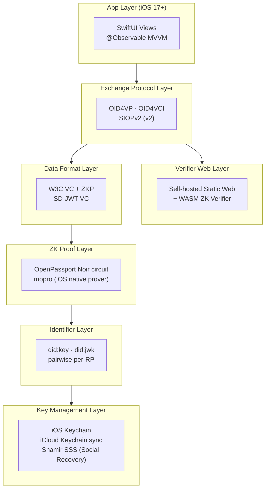

# Technology Stack

## Architecture Layers



---

## Native iOS Frameworks

| Framework | Purpose |
|-----------|---------|
| **SwiftUI** | Declarative UI |
| **SwiftData** | Local data persistence (`@Model` macro) |
| **MultipeerConnectivity** | Face-to-face P2P proximity networking |
| **AVFoundation** | Camera, QR scanning |
| **CoreImage** | QR Code generation |
| **CryptoKit** | AES-GCM encryption, ECIES |
| **PassKit** | Apple Wallet integration |
| **LocalAuthentication** | Face ID / Touch ID |
| **CloudKit** | Optional iCloud sync |
| **CoreNFC** | Passport NFC chip reading |
| **Vision** | MRZ OCR recognition |

**Minimum iOS**: 17.0 (required for SwiftData `@Model` macro, `@Observable` macro, NFC session bug fixes)

---

## Third-Party SDKs

| Purpose | SDK | Notes |
|---------|-----|-------|
| Passport NFC reading | NFCPassportReader (Swift) | APDU, BAC/PACE protocol |
| ZK Circuit | OpenPassport (Noir) | ICAO 9303 signature verification + age range proof |
| ZK Prover | mopro (zkmopro) | Noir → iOS native library |
| Secret Sharing | Swift Shamir SSS | Social Recovery |
| VC/DID | Native Swift implementation | did:key, SD-JWT, OID4VP |

---

## Data Persistence

| Data Type | Storage | Encryption |
|-----------|---------|------------|
| DID Master Key + per-RP Keys | iOS Keychain (iCloud Keychain sync) | Hardware + Apple E2EE |
| Credentials (VC) | SwiftData (App sandbox) | iOS Data Protection |
| Contacts | SwiftData (App sandbox) | iOS Data Protection |
| ZK Proofs | SwiftData (App sandbox) | iOS Data Protection |
| Settings | UserDefaults | None (non-sensitive) |
| Recovery Bundle | iCloud Drive (non-Keychain) | AES-GCM + ECIES |

---

## MVVM Pattern

```swift
// Model: solidarity/Models/Contact.swift
@Model
class Contact {
    var name: String
    var isVerified: Bool = false
    var verifiedAt: Date?
    var didPublicKey: String?
    var exchangeSignature: Data?
    // ...
}

// ViewModel (using @Observable macro)
@Observable
class PeopleViewModel {
    var contacts: [Contact] = []
    var isLoading = false
    // Changes automatically trigger SwiftUI view updates
}

// View: solidarity/Views/PeopleViews/PeopleListView.swift
struct PeopleListView: View {
    @State private var viewModel = PeopleViewModel()
    // ...
}
```

---

## Backup Strategy

| Layer | Mechanism | User Action |
|-------|-----------|-------------|
| Keys | iCloud Keychain (auto-sync) | None required |
| Keys (disaster recovery) | Social Recovery (Shamir + guardian) | One-time setup |
| App Data | iCloud App Backup (v1) | Toggle on/off |
| Export | VCF + VC bundle JSON + Graph Export | Manual, requires Face ID |

---

## Service Module Structure

```
solidarity/Services/
├── Identity/      (31 files) — DID, VC, VP, OIDC, Passport pipeline
├── Sharing/       (25 files) — Proximity, PassKit, QR, payload encryption
├── ZK/            (8 files)  — mopro, Semaphore, proof generation/verification
├── Card/          (9 files)  — QR generation/scanning, card formats
├── Vault/         (12 files) — Encrypted storage, time-lock
├── SocialGraph/   (2 files)  — Common friends hash exchange
├── Recovery/      (1 file)   — Social Recovery execution
├── CloudKit/      (6 files)  — Optional iCloud sync
└── Utils/         (18 files) — Encryption, Keychain, Logger
```

---

## Feature Scope

### v1 MVP (Current)

| Feature | Priority |
|---------|---------|
| DID key creation (Keychain) | P0 |
| Passport OCR + NFC + ZKP | P0 |
| Age / humanhood proof (OID4VP) | P0 |
| Face-to-face P2P exchange + common friends | P0 |
| Ephemeral message | P0 |
| Self-hosted Web Verifier (zero-install verification) | P0 |
| Social Graph Credential | P0 |
| Social Recovery (Shamir) | P1 |
| Onboarding full flow | P1 |
| iCloud Backup | P1 |

### v2 (Future)

| Feature | Notes |
|---------|-------|
| SIOPv2 passwordless login | Requires RP cooperation |
| E2EE Backup | Encrypted backup blob |
| MyData integration | Pull data from government platforms |

### Deferred (Removed from Scope)

| Feature | Reason |
|---------|--------|
| Group (Semaphore) | Too complex, practical use unvalidated |
| DIDComm | Reduce complexity |
| TLSNotary student proof | Project no longer actively maintained |
