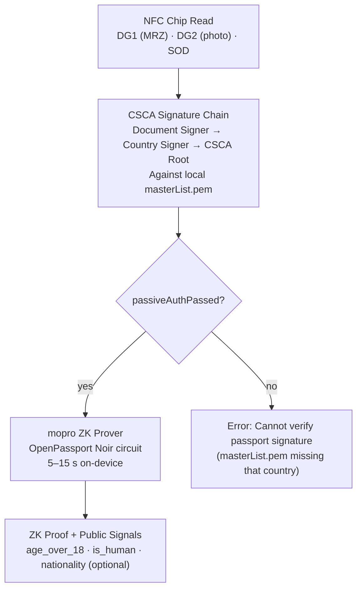

# Verification Model

A clear breakdown of every piece of data Solidarity actually verifies, the mechanism used, and what is **not** verified.

---

## Trust Levels at a Glance

| Level | Badge | Source | Verified by |
|-------|-------|--------|-------------|
| **L3 Government** | 🟢 | Passport NFC chip | CSCA signature chain + ZK proof (mopro) |
| **L2 Institution** | 🔵 | Institution-issued VC (v2 roadmap) | VC JWT signature + JWK trust anchor |
| **L1 Self-issued** | ⚪ | Self-filled card / Graph credential | ECDSA P-256 sender signature (no third-party) |

---

## What Is Verified Today

### Passport Identity (L3)



**What is verified**:
- Active Authentication / BAC/PACE handshake (NFC chip is genuine)
- SOD integrity: Document Signer Certificate signature over data groups
- CSCA chain: SOD's Document Signer Certificate traces back to a trusted CSCA root
- Passport expiry: `expiryDate` extracted from DG1 MRZ; VC expires accordingly

**What is NOT verified**:
- Online revocation of the passport (no CRL/OCSP call)
- Whether the person holding the device is the passport holder (biometric comparison not implemented)
- Liveness of the NFC chip against a reference database

**Code**: [`solidarity/Services/Identity/PassportPipelineService.swift`](https://github.com/p2p-solidarity/solidarity/blob/main/solidarity/Services/Identity/PassportPipelineService.swift), [`solidarity/Services/Identity/IssuerTrustAnchorStore.swift`](https://github.com/p2p-solidarity/solidarity/blob/main/solidarity/Services/Identity/IssuerTrustAnchorStore.swift)

---

### ZK Proof Output (L3)

After CSCA verification passes, the Noir circuit produces a zkSNARK proof. When this proof is later presented (VP token), the verifier checks:

| Check | Mechanism | Code |
|-------|-----------|------|
| Proof structure valid | mopro verifier (Noir circuit) | [`ProofVerifierService.swift`](https://github.com/p2p-solidarity/solidarity/blob/main/solidarity/Services/Identity/ProofVerifierService.swift) |
| Nonce matches verifier-issued nonce | JWT `nonce` claim comparison | [`OID4VPPresentationService.swift`](https://github.com/p2p-solidarity/solidarity/blob/main/solidarity/Services/Identity/OID4VPPresentationService.swift) |
| Token not expired | JWT `exp` — 45 second validity window | [`ProofVerifierService+VPToken.swift`](https://github.com/p2p-solidarity/solidarity/blob/main/solidarity/Services/Identity/ProofVerifierService+VPToken.swift) |
| `aud` matches verifier domain | JWT `aud` claim | [`ProofVerifierService+VPToken.swift`](https://github.com/p2p-solidarity/solidarity/blob/main/solidarity/Services/Identity/ProofVerifierService+VPToken.swift) |
| No replay | Nonce consumed after first use | [`NonceStore.swift`](https://github.com/p2p-solidarity/solidarity/blob/main/solidarity/Services/Identity/NonceStore.swift) |

The 45-second VP token window means the proof must be freshly generated for each presentation — no stockpiling old proofs.

---

### P2P Contact Card (L1)

During face-to-face exchange, the received payload is verified before saving:

```swift
// solidarity/Services/Sharing/ProximityManager+SessionDelegate.swift

// Step 1: Verify ECDSA P-256 payload signature
verify(payloadSignature, over: canonical(cardFields, senderDID, timestamp),
       using: senderDID.publicKey)

// Step 2: If issuerProof present → verify Semaphore proof
if let issuerProof = payload.issuerProof {
    verify(issuerProof, root: payload.groupRoot, signal: payload.signal, scope: payload.scope)
}

// Step 3: If sdProof present → verify field commitments and signature
if let sdProof = payload.sdProof {
    verify(sdProof.signature, over: sdProof.canonicalPayload)
    // Verify each committed field: SHA256(committed_value) == commitment_hash
}
```

**Code**: [`solidarity/Services/Sharing/ProximityManager+SessionDelegate.swift`](https://github.com/p2p-solidarity/solidarity/blob/main/solidarity/Services/Sharing/ProximityManager+SessionDelegate.swift)

**What this confirms**: the sender controls the private key corresponding to their DID. It does **not** confirm that the name/email/phone values are true.

---

### Semaphore Group Membership (L2 Peer Group)

When a payload includes a Semaphore issuer proof, the verifier checks:

| Check | Value |
|-------|-------|
| Merkle root matches expected group root | `groupRoot == expectedRoot` |
| Signal matches application context | `signal == expectedSignal` |
| Scope matches proof purpose | `scope == expectedScope` |
| Minimum group size | `memberCount ≥ 2` |
| Computed root matches provided root | Rebuilds Merkle tree from commitments |

**Code**: [`solidarity/Services/ZK/SemaphoreIdentityManager.swift`](https://github.com/p2p-solidarity/solidarity/blob/main/solidarity/Services/ZK/SemaphoreIdentityManager.swift)

---

### Institution Credentials (L2 — v2 Roadmap)

Framework exists (`CredentialIssuanceService.swift`, `OIDCTokenService.swift`) but is not yet integrated into the main flow. When complete, verification will include:

- VC JWT signature using institution's JWK
- `exp` / `iat` claim checking
- Issuer DID resolution (via issuer's well-known endpoint)
- Revocation status (endpoint TBD)

---

## What Is NOT Verified

| Data | Why Not |
|------|---------|
| Raw name / email / phone in card | Signature proves sender identity, not data truthfulness |
| Device model or OS | No hardware attestation in current architecture |
| NFC chip liveness vs a revocation database | No online check — fully offline |
| Apple Wallet pass integrity on receiver side | Pass QR is scanned to import, not cryptographically validated end-to-end |
| Ephemeral message content | Delivered over MCSession TLS only; not signed |

---

## Verification Summary

```
Passport NFC     → CSCA chain + ZK proof = strongest guarantee (L3 Government)
P2P Card         → ECDSA P-256 sender signature = identity confirmed, values unverified (L1)
Group membership → Semaphore ZKP = member of group without identity reveal (L2 Peer)
QR code scan     → syntax validation only; no signature if plain card format (L1 or unverified)
VP token         → nonce + exp + aud + ZK proof = replay-resistant proof presentation
```
