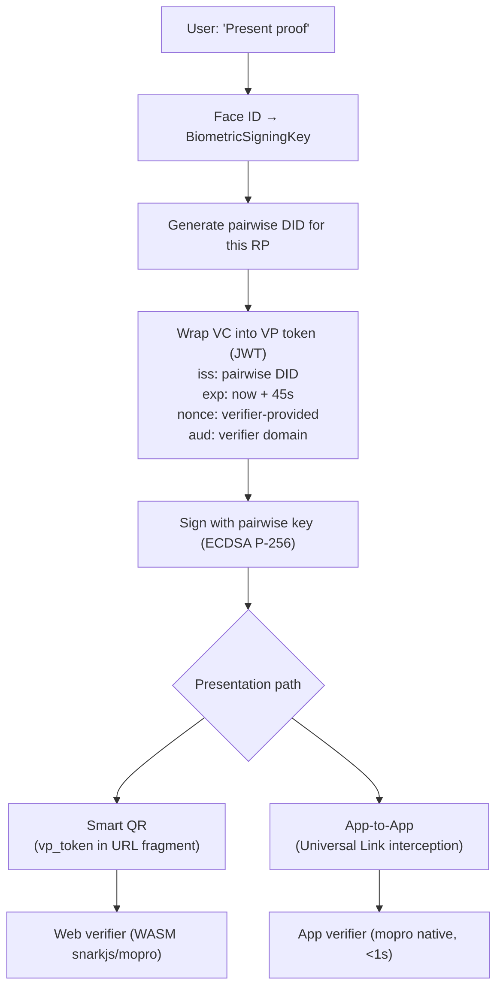

# Wallet Architecture

Solidarity is often described as a "wallet." This page defines exactly what that means — and where the boundaries are.

---

## Summary

| Claim | Status | Notes |
|-------|--------|-------|
| **VC Wallet** | Partial | Stores self-issued VCs; institutional issuance (OID4VCI) is a stub |
| **VP Wallet** | Full | Complete OID4VP presentation with pairwise DID, nonce, expiry |
| **Apple Wallet integration** | Functional | Pass generation + signing; no revocation or streaming updates |

---

## VC Wallet

### What Works

- **Storage**: `IdentityCardEntity` (SwiftData, encrypted at rest) stores raw VC JWTs
- **Index**: `VCLibrary.StoredCredential` provides fast lookup by type and trust level
- **Self-issuance**: after passport NFC + ZKP, the app self-issues a W3C VC JWT and stores it locally
- **Format**: W3C VC JWT with `credentialSubject` containing ZK proof public signals

### What Is Missing

- **Institutional issuance**: `CredentialIssuanceService.swift` is a stub — no issuer is integrated, and the credential request signing is incomplete
- **Revocation checks**: no CRL or status endpoint is queried; expiry is the only mechanism
- **Presentation definition matching**: the app does not implement the full OID4VP presentation definition exchange to select which VC to present for a given verifier's requirements

### Boundaries

Solidarity is best described as a **self-issued VC platform** — the user's government passport is the trust root, and the app issues a VC to itself after verifying that passport. It is not yet a general-purpose VC wallet that can receive credentials from arbitrary issuers.

---

## VP Wallet

### What Works

Full OID4VP presentation pipeline:



| Capability | Status |
|-----------|--------|
| Pairwise DID per RP | ✅ |
| Nonce + expiry (replay prevention) | ✅ |
| ZK proof in VC (passport-backed) | ✅ |
| Selective VC presentation | ✅ (choose which VC to present) |
| URL fragment privacy | ✅ (server never sees vp_token) |
| App-to-app verification < 1s | ✅ |
| Web WASM verifier | ✅ |
| Cross-RP identity isolation | ✅ (independent key pair per RP) |

**Code**: [`solidarity/Services/Identity/OID4VPPresentationService.swift`](https://github.com/p2p-solidarity/solidarity/blob/main/solidarity/Services/Identity/OID4VPPresentationService.swift)

---

## Apple Wallet Integration

### What Works

```
Device (local)                         Cloudflare Worker (stateless)
─────────────────────────────────────  ─────────────────────────────
1. Assemble pass.json (card fields)
2. Compute SHA256(each pass file)
3. Build manifest.json              →  Receive manifest_hash only
                                       Sign with Apple PassKit cert
                                    ←  Return PKCS#7 detached signature
4. Bundle into .pkpass
5. Add to Apple Wallet via PassKit
```

**Privacy design**: the Cloudflare Worker receives only SHA256 hashes — never card content, name, email, or any PII.

**Code**: [`solidarity/Services/Sharing/PassKitManager.swift`](https://github.com/p2p-solidarity/solidarity/blob/main/solidarity/Services/Sharing/PassKitManager.swift)

### Supported Capabilities

- Lock screen quick access (iPhone XS+)
- NFC tap support (if device supports it)
- QR code in pass → app deep-link → contact import
- Works offline (pass is static after creation)

### Limitations

| Limitation | Impact |
|-----------|--------|
| No revocation | Pass stays in wallet even after card fields are updated in-app |
| No streaming update | Pass content is frozen at creation time |
| No ZK-gated unlock | Cannot require a ZK proof to "open" the pass |
| No Apple Wallet credential standard | Uses generic pkpass, not the newer Wallet credential API |

---

## Architecture Layers

```
┌──────────────────────────────────────────────┐
│ Credential Storage (VC Wallet)               │
│   IdentityCardEntity · VCLibrary · SwiftData │
├──────────────────────────────────────────────┤
│ Credential Presentation (VP Wallet)          │
│   OID4VPPresentationService                  │
│   BiometricSigningKey · Pairwise DID         │
│   VP token (45s) · nonce · aud               │
├──────────────────────────────────────────────┤
│ Proof Verification                           │
│   ProofVerifierService (app, mopro)          │
│   verify.solidarity.app (web, WASM)          │
├──────────────────────────────────────────────┤
│ Export (Apple Wallet)                        │
│   PassKitManager · PKCS#7 · Cloudflare       │
└──────────────────────────────────────────────┘
```

---

## Accurate Description

Solidarity is most accurately described as:

- **Self-Issued VC Platform**: issues VCs derived from a government passport (CSCA-verified + ZK proof), stored locally, no institutional issuer required
- **Privacy-First Proof Presenter**: OID4VP specialized for derived claims (age, humanhood) with zero PII disclosure, pairwise DIDs, and URL-fragment privacy
- **Passbook Integration**: Apple Wallet as a distribution and quick-access channel, not as a credential store

It is **not yet** a general-purpose VC wallet (no OID4VCI with real issuers), and the Apple Wallet integration does not use Apple's newer Wallet Credential API.
