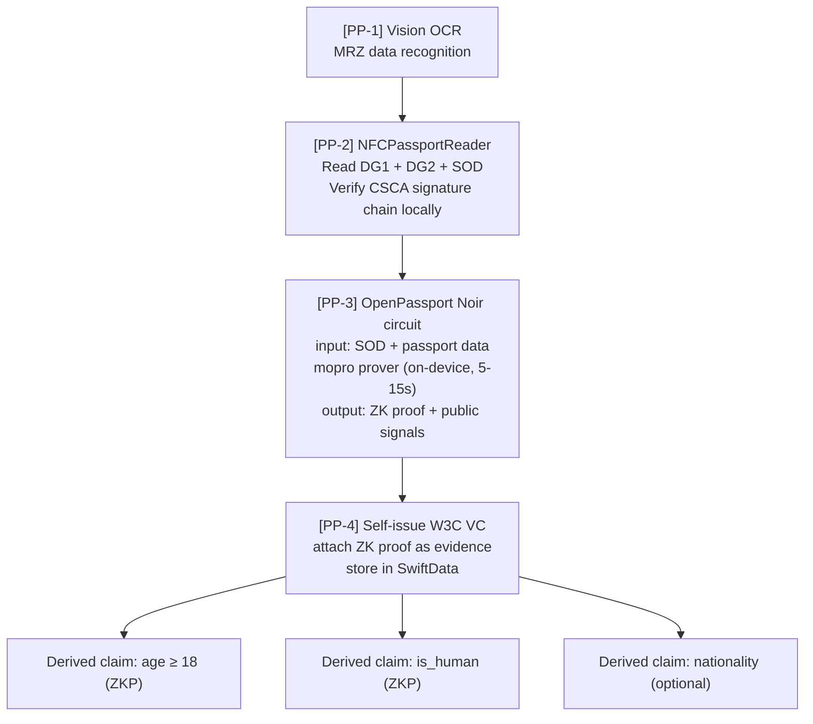
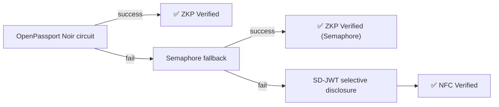
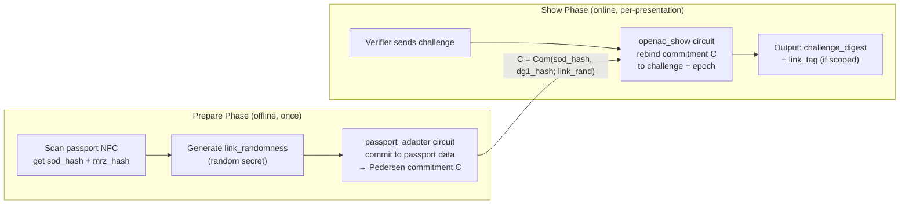
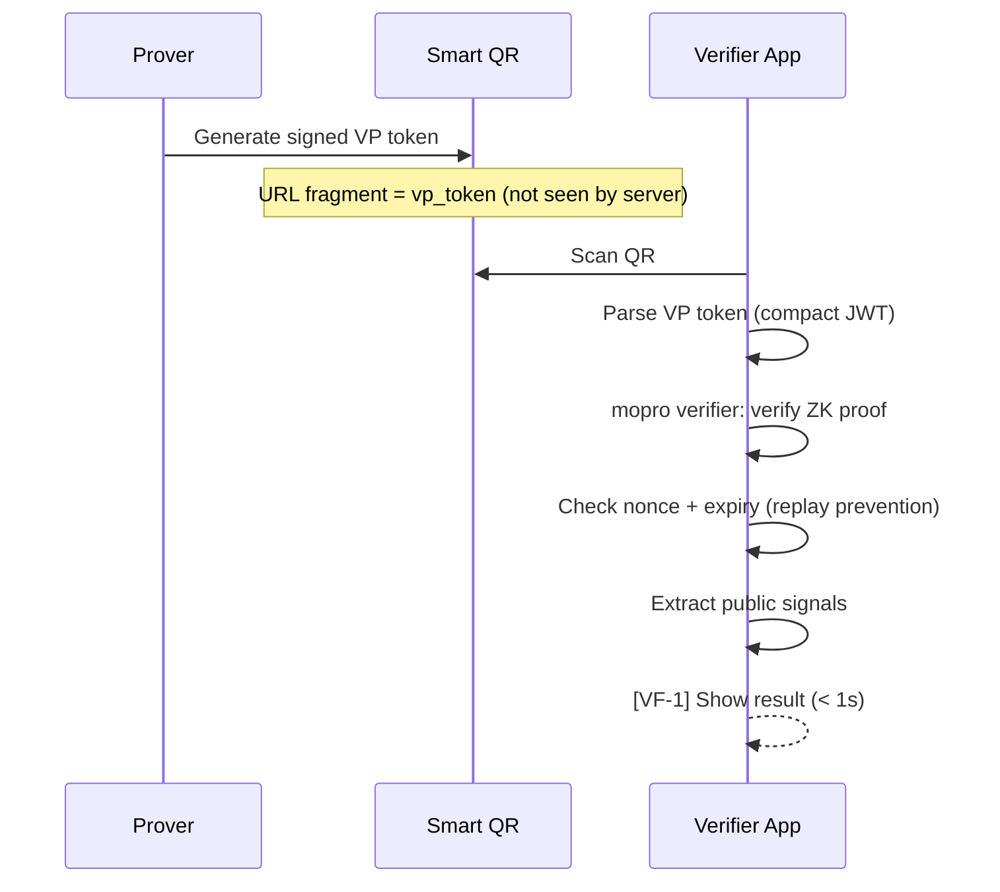

# Zero-Knowledge Proofs

Solidarity's ZKP core feature is passport-derived zero-knowledge proofs: read data from a passport NFC chip, generate a ZK proof on-device, and prove age or humanhood to anyone — without revealing any raw passport data.

The ZK circuits live in a separate maintained repository: **[p2p-solidarity/passport-noir](https://github.com/p2p-solidarity/passport-noir)**, distributed to the app as an iOS Swift Package (`OpenPassportSwift`).

---

## Passport ZKP Pipeline



### Pipeline Stage Details

| Stage | Technology | Code |
|-------|-----------|------|
| MRZ OCR | Vision Framework `VNRecognizeTextRequest` | [`Services/Identity/NFCPassportReaderService.swift`](https://github.com/p2p-solidarity/solidarity/blob/main/solidarity/Services/Identity/NFCPassportReaderService.swift) |
| NFC reading | NFCPassportReader (BAC/PACE) | [`Services/Identity/PassportPipelineService.swift`](https://github.com/p2p-solidarity/solidarity/blob/main/solidarity/Services/Identity/PassportPipelineService.swift) |
| CSCA verification | Local `masterList.pem` | [`Services/Identity/IssuerTrustAnchorStore.swift`](https://github.com/p2p-solidarity/solidarity/blob/main/solidarity/Services/Identity/IssuerTrustAnchorStore.swift) |
| ZK proof generation | OpenPassport Noir + mopro | [`Services/ZK/MoproProofService.swift`](https://github.com/p2p-solidarity/solidarity/blob/main/solidarity/Services/ZK/MoproProofService.swift) |
| VC wrapping | W3C VC self-issued | [`Services/Identity/VCService.swift`](https://github.com/p2p-solidarity/solidarity/blob/main/solidarity/Services/Identity/VCService.swift) |

---

## ZKP Fallback Chain

If ZK proof generation fails (missing circuit/SRS or runtime failure), the app degrades gracefully:



**Trust badge difference**: ZKP path → "ZKP Verified"; NFC fallback → "NFC Verified" (still passport-backed, different proof type).

**Code**: [`solidarity/Services/ZK/MoproProofService+Fallbacks.swift`](https://github.com/p2p-solidarity/solidarity/blob/main/solidarity/Services/ZK/MoproProofService+Fallbacks.swift)

---

## OpenPassport + mopro

**OpenPassport** uses Noir (Aztec's ZK DSL) to write circuits that verify ICAO 9303 passport cryptographic signatures and produce ZK proofs for derived claims:

- `age_over_18`: age ≥ 18 (without revealing date of birth)
- `is_human`: holds a valid passport (without revealing name)
- `nationality` (optional)

**mopro** compiles Noir circuits to an iOS native library and runs the ZK prover on-device (5-15 seconds, no network required).

```swift
// solidarity/Services/ZK/MoproProofService.swift
func generatePassportProof(passportData: PassportData) async throws -> ZKProof {
    // 1. Prepare circuit inputs (extracted from passport DG1/SOD)
    let inputs = prepareCircuitInputs(passportData)

    // 2. mopro runs prover on-device
    let proof = try await mopro.generateProof(inputs: inputs)

    // 3. Output: proof bytes + public signals
    return ZKProof(proof: proof.proofBytes, publicSignals: proof.publicSignals)
}
```

---

## Noir Circuit Library (passport-noir)

**Repo**: [github.com/p2p-solidarity/passport-noir](https://github.com/p2p-solidarity/passport-noir)

The library contains 11 Noir circuits organized in two layers — base verification circuits and OpenAC protocol circuits.

### Base Circuits: ICAO 9303 Passport Verification

These three circuits implement standard ePassport verification and are the foundation of every proof.

#### `passport_verifier` — Active Authentication

**What it verifies**: RSA-2048 / PKCS#1 v1.5 / SHA-256 signature from the Document Signer Certificate (DSC) over the Security Object Document (SOD). This is **ICAO 9303 Active Authentication** — it proves the chip's data was signed by a legitimate government signer.

```
Public inputs:  modulus_limbs [u128; 18]  — DSC RSA-2048 public key (verifier checks against CSCA)
Private inputs: sod_hash      [u8; 32]   — SHA-256 of SOD signed attributes
                signature_limbs [u128; 18] — RSA signature
```

**Trust anchor check (done in app, not in circuit)**: after proof is generated, the DSC modulus in `modulus_limbs` is verified against `masterList.pem` (CSCA root store) in [`IssuerTrustAnchorStore.swift`](https://github.com/p2p-solidarity/solidarity/blob/main/solidarity/Services/Identity/IssuerTrustAnchorStore.swift). The circuit only proves the math; the app adds the issuer trust check.

#### `data_integrity` — Passive Authentication

**What it verifies**: SHA-256 hash chain from raw Data Group content up to the SOD hash. This is **ICAO 9303 Passive Authentication** — it proves DG1/DG2/DG3/DG4 have not been tampered with since the chip was signed.

```
Hash chain:
  SHA256(DG1_content) → expected_dg_hashes[0]
  SHA256(DG2_content) → expected_dg_hashes[1]
  ...
  SHA256(concat_of_all_dg_hashes) → sod_hash

Public inputs:  expected_dg_hashes [[u8;32];4]  — from SOD
                sod_hash            [u8; 32]     — SOD content hash
Private inputs: dg_contents         [[u8;512];4] — raw DG data
```

#### `disclosure` — Selective MRZ Disclosure

**What it verifies**: Extracts and selectively reveals fields from the ICAO 9303 TD3 MRZ (88-character, 2 × 44 chars), while keeping all other fields private.

```
Private input:  mrz_data [u8; 88]     — full MRZ (never revealed)
Public input:   mrz_hash [u8; 32]     — ties to data_integrity proof

Disclosure flags (caller-controlled):
  disclose_nationality → reveals 3-letter ICAO code (chars 54–56)
  disclose_older_than  → reveals bool: age ≥ age_threshold (chars 57–62, DOB)
  disclose_name        → reveals 39-byte surname/given name (chars 5–43)
```

This circuit is how `age_over_18` and `is_human` are produced without ever revealing the underlying DOB or name.

---

### OpenAC Protocol Circuits

**OpenAC** ("Open Design for Transparent and Lightweight Anonymous Credentials") is a two-phase anonymous credential protocol developed by the zkID Team at PSE / Ethereum Foundation. Solidarity's passport-noir implements OpenAC for passport credentials.

**The two phases:**



#### `passport_adapter` — OpenAC Prepare for Passports

Combines `passport_verifier` + `data_integrity` + Pedersen commitment into a single prove-once artifact:

```
Output: out_commitment_x, out_commitment_y  (Grumpkin curve point)
        modulus_limbs                        (DSC public key, for CSCA check)

Commitment: C = Pedersen(sod_hash ∥ dg1_hash; link_rand)  on Grumpkin curve
```

The commitment `C` links the Prepare proof to all subsequent Show proofs without re-reading the passport.

#### `sdjwt_adapter` — OpenAC Prepare for SD-JWT

Same prepare phase but for SD-JWT credentials instead of passports. Uses ECDSA P-256 (ES256) instead of RSA-2048, and verifies up to 8 selective disclosures:

```
Private: jwt_payload_hash + ECDSA P-256 signature (issuer)
         up to 8 disclosure salts + claim values
Output:  Pedersen commitment on Grumpkin
```

Enables the same prepare/show flow for institution-issued credentials (v2).

#### `openac_show` — Generic Show Circuit

Credential-type agnostic show circuit. Takes any adapter's commitment `C` and:

1. Re-derives `C` from private inputs (binding check)
2. Computes `challenge_digest = SHA256(domain ∥ challenge ∥ C ∥ epoch)` (challenge binding)
3. If `link_mode = true`: computes `link_tag = SHA256(domain ∥ C ∥ scope ∥ epoch)` for scoped linking
4. Evaluates predicates: age ≥ threshold, nationality disclosure

#### `prepare_link` + `show_link` — Commitment Linking Primitives

Low-level building blocks. `prepare_link` outputs `SHA256("openac.preparev1" ∥ sod_hash ∥ mrz_hash ∥ link_rand)`; `show_link` re-derives it and binds it to a verifier challenge. Used internally by the adapter and show circuits.

#### `device_binding` — Device-Binding Assertion

Verifies an ECDSA P-256 signature from the device's Secure Enclave over a live nonce, proving the proof was generated on a specific device:

```
Public inputs: pub_key_x, pub_key_y [u8; 32]  — device public key
               message_hash         [u8; 32]  — SHA-256(challenge_nonce)
Private input: signature            [u8; 64]  — Secure Enclave ECDSA signature (r ∥ s)
```

> **Current integration status**: `device_binding` circuit is implemented in passport-noir but not yet wired into the app's proof generation path. When integrated, it would embed the Secure Enclave signature into the ZK proof, providing cryptographic device binding. See [Advanced Capabilities](/architecture/advanced-capabilities) for the architecture discussion.

---

### Circuit Summary

| Circuit | Layer | ICAO / Protocol | Key Output |
|---------|-------|----------------|-----------|
| [`passport_verifier`](https://github.com/p2p-solidarity/passport-noir/tree/main/circuits/passport_verifier) | Base | Active Auth (RSA-2048) | DSC signature valid |
| [`data_integrity`](https://github.com/p2p-solidarity/passport-noir/tree/main/circuits/data_integrity) | Base | Passive Auth (DG hash chain) | DGs not tampered |
| [`disclosure`](https://github.com/p2p-solidarity/passport-noir/tree/main/circuits/disclosure) | Base | TD3 MRZ | age / nationality / name (selective) |
| [`passport_adapter`](https://github.com/p2p-solidarity/passport-noir/tree/main/circuits/passport_adapter) | OpenAC Prepare | Passport credential | Pedersen commitment C |
| [`sdjwt_adapter`](https://github.com/p2p-solidarity/passport-noir/tree/main/circuits/sdjwt_adapter) | OpenAC Prepare | SD-JWT credential | Pedersen commitment C |
| [`openac_show`](https://github.com/p2p-solidarity/passport-noir/tree/main/circuits/openac_show) | OpenAC Show | Any credential | challenge\_digest, link\_tag |
| [`prepare_link`](https://github.com/p2p-solidarity/passport-noir/tree/main/circuits/prepare_link) | OpenAC primitive | — | prepare commitment |
| [`show_link`](https://github.com/p2p-solidarity/passport-noir/tree/main/circuits/show_link) | OpenAC primitive | — | challenge binding |
| [`device_binding`](https://github.com/p2p-solidarity/passport-noir/tree/main/circuits/device_binding) | OpenAC assertion | ECDSA P-256 SE | device-bound nonce proof |
| [`openac_core`](https://github.com/p2p-solidarity/passport-noir/tree/main/circuits/openac_core) | Library | — | commit / show / predicate helpers |

**Dependencies**: `noir_rsa` (zkpassport), `bignum` (noir-lang), `sha256` (noir-lang), `std::embedded_curve_ops` (Grumpkin Pedersen)

---

## Verification Flow

### App-to-App Verification (< 1s)



**Code**:
- [`solidarity/Services/Identity/ProofVerifierService.swift`](https://github.com/p2p-solidarity/solidarity/blob/main/solidarity/Services/Identity/ProofVerifierService.swift)
- [`solidarity/Services/Identity/ProofVerifierService+VPToken.swift`](https://github.com/p2p-solidarity/solidarity/blob/main/solidarity/Services/Identity/ProofVerifierService+VPToken.swift)

### Web Verifier (WASM)

Verifier has no App → scans Smart QR → opens `verify.solidarity.app`

```
Browser extracts vp_token from URL fragment
  → Browser-side WASM ZK verifier (snarkjs or mopro-wasm)
  → Verify ZK proof (same logic as App)
  → Display result [VF-W]
```

**Privacy guarantee**: proof is in URL fragment (`#`), server never sees it.

---

## VP Token Format (OID4VP)

VP token sent by Prover:

```json
{
  "iss": "did:key:z6Mk...",
  "iat": 1710000000,
  "exp": 1710000045,
  "nonce": "verifier-provided-nonce",
  "aud": "https://bar-abc.example.com",
  "vp": {
    "@context": ["https://www.w3.org/2018/credentials/v1"],
    "type": ["VerifiablePresentation"],
    "holder": "did:key:z6Mk...",
    "verifiableCredential": [
      "eyJhbGciOiJFUzI1NiIsInR5cCI6IkpXVCJ9..."
    ]
  }
}
```

Each VC is a self-issued W3C VC (JWT format), with `credentialSubject` containing ZK proof public signals (`age_over_18: true`, `is_human: true`).

**Code**: [`solidarity/Services/Identity/OID4VPPresentationService.swift`](https://github.com/p2p-solidarity/solidarity/blob/main/solidarity/Services/Identity/OID4VPPresentationService.swift) (`wrapCredentialsAsVP`)

---

## Trust Model

| Level | Badge | Source | Trust Anchor | Verification |
|-------|-------|--------|-------------|--------------|
| L3 Government | 🟢 | Passport NFC chip | CSCA national signature | ZKP (mopro) or NFC direct |
| L2 Institution | 🔵 | Institution-issued VC (v2) | Institution X.509 cert | VC signature verification |
| L1 Self-issued | ⚪ | Self-filled / Graph Credential | self-issued | No third-party verification |

---

## Selective Disclosure: Current State

The current implementation is a **hybrid design** across two conceptually different axes:

### Axis 1 — Derived Claims (ZK, no field selection)

| Path | Type | What is proven |
|------|------|----------------|
| OpenPassport Noir | True zkSNARK | `age_over_18`, `is_human`, `nationality` — no raw passport data |
| Semaphore (fallback) | zkSNARK (partial) | Group membership without revealing identity |
| SD-JWT (fallback) | Signature + SHA256 commitment | Signed card with commitment hashes — **not ZK** |

### Axis 2 — Business Card Fields (Signature-based, field selection)

Pre-configured field selection (name, email, phone, etc.) uses `SelectiveDisclosureProof`: each hidden field is committed as `SHA256(value)` and the whole proof is ECDSA-signed. This is **not zero-knowledge** — it is a commitment scheme. A verifier who already knows a field value can confirm it matches the commitment.

**Why the split**: ZK proofs for arbitrary text fields (name, email) would be expensive and add no meaningful trust — the values are unverified regardless. ZK is reserved for the claims where it matters: proving a fact about a government document without revealing the document.

**Semaphore vs Noir**: Semaphore is primarily used for **group membership** (Axis 1 fallback and dedicated group use cases). OpenPassport Noir is the primary path for **passport-derived claims**. When Noir is unavailable, Semaphore acts as a degraded alternative — it can attest "member of a verified passport group" but cannot directly encode `age_over_18`.

**Code**:
- [`solidarity/Services/ZK/ProofGenerationManager.swift`](https://github.com/p2p-solidarity/solidarity/blob/main/solidarity/Services/ZK/ProofGenerationManager.swift) (SelectiveDisclosureProof)
- [`solidarity/Services/ZK/SemaphoreIdentityManager.swift`](https://github.com/p2p-solidarity/solidarity/blob/main/solidarity/Services/ZK/SemaphoreIdentityManager.swift)
- [`solidarity/Services/ZK/SemaphoreGroupManager.swift`](https://github.com/p2p-solidarity/solidarity/blob/main/solidarity/Services/ZK/SemaphoreGroupManager.swift)
