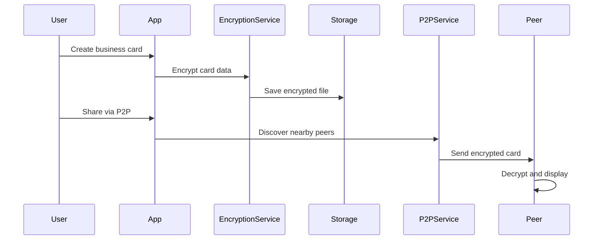
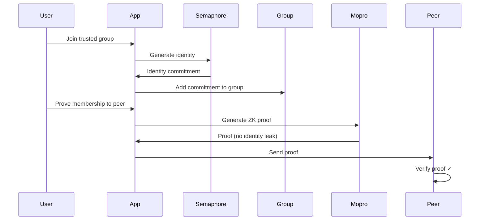

# Technical Overview

Understanding how Solidarity keeps your data private and secure while enabling seamless contact sharing.

## Privacy-First Design

### Your Data Stays on Your Device

**Local Storage Only**
- All business cards stored encrypted on your iPhone
- No cloud servers or external databases
- You control your data completely

**Military-Grade Encryption**
- AES-GCM 256-bit encryption for all stored data
- Encryption keys stored in iOS Keychain (hardware-backed when available)
- Even if someone accesses your device, your data remains protected

### Zero-Knowledge Group Verification

**What is Zero-Knowledge?**
Zero-knowledge proofs let you prove you belong to a group (like a company) without revealing who you are or any other personal information.

**How it works:**
1. Join a verified group (e.g., your company's employee group)
2. Generate a cryptographic proof of membership
3. Share the proof without revealing your identity
4. Others can verify you're a legitimate member

**Benefits:**
- Prove credentials without exposing personal data
- No central authority needed
- Mathematically impossible to fake

## Offline-First Technology

### Peer-to-Peer Networking

**Direct Device Connections**
- Uses Apple's MultipeerConnectivity framework
- Creates local WiFi networks between devices
- Works without internet connection

**How Sharing Works:**
1. Both devices discover each other nearby
2. Secure connection established automatically
3. Encrypted data transferred directly
4. No intermediary servers involved

### QR Code Backup

**Universal Compatibility**
- Works with any camera or QR scanner
- No app required to receive basic contact info
- Fallback when devices can't connect directly

## Security Architecture

### Multi-Layer Protection

**Device Level**
- iOS Keychain for sensitive data storage
- App sandboxing prevents other apps from accessing data
- Biometric authentication (Face ID/Touch ID) support

**Network Level**
- All peer-to-peer connections encrypted
- Perfect forward secrecy (each session uses unique keys)
- No data transmitted to external servers

**Application Level**
- Granular privacy controls per sharing session
- Automatic data expiration options
- Audit trail of what was shared when

### Privacy Levels Explained

**Technical Implementation**
- Each privacy level creates a filtered version of your card
- Encryption keys differ for each level
- Recipients only get data for their assigned level

**Public Level**
- Basic professional information
- Safe for wide distribution
- No sensitive personal data

**Professional Level**
- Full business contact details
- Verified through group membership when applicable
- Suitable for business networking

**Personal Level**
- Complete contact information
- Only for trusted connections
- Highest level of detail

## Apple Ecosystem Integration

### Wallet Integration

**Native iOS Experience**
- Creates standard PassKit passes
- Appears in Apple Wallet alongside other cards
- Quick access from lock screen

**Technical Benefits**
- Leverages iOS security model
- Familiar user interface
- Works with existing iOS workflows

### System Integration

**iOS Features Used**
- Keychain Services for secure storage
- MultipeerConnectivity for networking
- Core Image for QR code generation
- PassKit for Wallet integration
- LocalAuthentication for biometrics

## Performance Considerations

### Optimized for Mobile

**Battery Efficiency**
- Minimal background processing
- Efficient peer discovery algorithms
- Smart connection management

**Storage Efficiency**
- Compressed data formats
- Efficient encryption overhead
- Automatic cleanup of temporary files

**Network Efficiency**
- Only transfers necessary data
- Compression for large transfers
- Automatic retry with backoff

## Future-Proof Design

### Extensible Architecture

**Modular Components**
- Separate services for storage, networking, encryption
- Easy to update individual components
- Plugin architecture for new features

**Standards-Based**
- Uses established cryptographic protocols
- Compatible with standard QR code readers
- Follows iOS development best practices

---

Want to see these technologies in action? Check out our [Usage Guide](/docs/usage) to learn how to use Solidarity effectively.

Built on the [Semaphore Protocol](https://semaphore.appliedzkp.org/), enabling:

- Anonymous group membership verification
- No identity leakage during proofs
- Cryptographic privacy guarantees

### Selective Disclosure

Users control exactly what information to share:

- **Public**: Visible to everyone (name, company)
- **Professional**: Shared with verified professionals
- **Personal**: Only for trusted contacts

## Technology Stack

### SwiftUI + MVVM

The app uses **SwiftUI** with the **MVVM (Model-View-ViewModel)** pattern:

```swift
// Model: BusinessCard.swift
struct BusinessCard: Codable {
    let id: UUID
    var name: String
    var company: String?
    var privacyLevel: PrivacyLevel
}

// ViewModel: BusinessCardViewModel.swift
@Observable
class BusinessCardViewModel {
    var cards: [BusinessCard] = []

    func createCard(_ card: BusinessCard) {
        // Business logic
    }
}

// View: BusinessCardView.swift
struct BusinessCardView: View {
    @State private var viewModel = BusinessCardViewModel()

    var body: some View {
        // SwiftUI UI code
    }
}
```

### MultipeerConnectivity

Apple's framework for P2P networking:

- **Discovery**: Automatic peer discovery via Bluetooth and WiFi
- **Connection**: Secure connections without internet
- **Transfer**: Efficient data transfer between devices

```swift
// Simplified P2P flow
class P2PService: NSObject, MCSessionDelegate {
    let serviceType = "solidarity-p2p"
    let peerID = MCPeerID(displayName: UIDevice.current.name)

    func startAdvertising() {
        advertiser.startAdvertisingPeer()
    }

    func send(card: BusinessCard, to peer: MCPeerID) {
        let data = try? JSONEncoder().encode(card)
        try? session.send(data, toPeers: [peer], with: .reliable)
    }
}
```

### Zero-Knowledge Proofs with Semaphore

**Semaphore** enables private group membership:

- **Identity Generation**: Create a private identity (never shared)
- **Group Membership**: Join groups with identity commitment
- **Proof Generation**: Prove membership without revealing identity
- **Verification**: Others verify proof without seeing your identity

```swift
// Identity creation
let identity = try Identity.generateRandom()

// Generate proof of group membership
let proof = try semaphore.generateProof(
    identity: identity,
    groupId: groupId,
    signal: "I'm verified"
)

// Verify proof (no identity leaked)
let isValid = try semaphore.verifyProof(proof)
```

**Implementation via Mopro:**

Solid(ar)ity uses [Mopro](https://zkmopro.org/) for native Swift ZK proof generation:

- **Native Bindings**: Swift wrapper around Rust ZK libraries
- **On-Device**: All proofs generated locally
- **Fast**: Optimized for mobile performance

### Encrypted Storage

All data is encrypted at rest using **AES-GCM**:

```swift
class EncryptionService {
    func encrypt(_ data: Data) throws -> Data {
        let key = getOrCreateEncryptionKey() // Stored in Keychain
        return try AES.GCM.seal(data, using: key).combined
    }

    func decrypt(_ data: Data) throws -> Data {
        let key = getEncryptionKey()
        let sealedBox = try AES.GCM.SealedBox(combined: data)
        return try AES.GCM.open(sealedBox, using: key)
    }
}
```

**Key Management:**

- Encryption keys stored in **Keychain** (hardware-backed when available)
- Never exported or transmitted
- Unique per app installation

### PassKit Integration

Save cards to Apple Wallet:

```swift
class PassKitService {
    func createPass(for card: BusinessCard) throws -> PKPass {
        let pass = createPassData(card)
        let signedPass = signPass(pass) // Requires Pass Certificate
        return try PKPass(data: signedPass)
    }
}
```

**Note**: PassKit signing requires a Pass Type ID certificate from Apple Developer Portal.

## Data Flow

### Creating and Sharing a Card



### Zero-Knowledge Group Verification



## Security Model

### Threat Model

**Protected Against:**

- Server breaches (no servers)
- Network eavesdropping (encrypted P2P)
- Identity tracking (zero-knowledge proofs)
- Unauthorized access (local encryption)

**Not Protected Against:**

- Physical device access (requires device security)
- Malicious peers (user must trust who they share with)
- Social engineering (user discretion required)

### Privacy Guarantees

- **No Data Collection**: Zero telemetry, no analytics
- **Local Only**: Nothing leaves device without explicit user action
- **Encrypted at Rest**: All data protected with AES-GCM
- **Anonymous Proofs**: ZK proofs reveal no identity information
- **Selective Sharing**: User controls what information to disclose

## Performance Considerations

### ZK Proof Generation

- **Time**: 1-3 seconds on modern devices
- **Battery**: Minimal impact (one-time generation)
- **Optimization**: Proofs cached and reused when possible

### P2P Discovery

- **Range**: ~30 feet (Bluetooth) / ~100 feet (WiFi)
- **Latency**: &lt;1 second for peer discovery
- **Concurrent Connections**: Up to 8 peers simultaneously

### Storage

- **Card Size**: ~1KB per card (encrypted)
- **Proof Size**: ~500 bytes per proof
- **Total Footprint**: &lt;10MB for typical usage

## Future Architecture

Planned improvements for v2.0+:

- **Cross-Platform**: Android and web versions with shared protocols
- **ENS Integration**: Ethereum Name Service for decentralized identity
- **IPFS Support**: Distributed storage for large attachments
- **Advanced ZKPs**: More selective disclosure options

---

Next: Learn about all available [Features](/docs/features)
