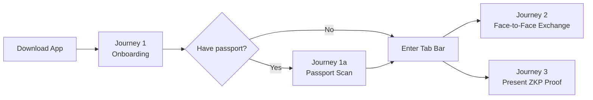

# Usage Guide

Solidarity is organized around three core journeys, each corresponding to a major use case.

---

## Journey 1 — Onboarding

Set up in 3 minutes: create your DID identity, import contacts, and scan your passport.

**Key screens**: O-1 Welcome → O-2 Keychain Setup → O-3 Import Contacts → O-4 Scan Passport → O-5 Complete

[Details →](/usage/quick-start)

---

## Journey 2 — Face-to-Face Card Exchange

Both users open the app, discover each other via Bluetooth proximity, and exchange cryptographically signed cards. Supports bidirectional ephemeral messages.

**Key screens**: EX-1 Discovery → EX-2 Confirm Card → EX-5 Exchange Success + Ephemeral Message

**Mutual tap fast path**: if both parties tap each other, skip request/accept and go straight to confirm.

[Details →](/usage/sharing-methods)

---

## Journey 3 — Present ZKP Proof

Present passport-derived zero-knowledge proofs (age ≥ 18, humanhood) to verifiers. Supports App-to-App scan and No-App Web verification.

**Key screens**: PR-1b Smart QR Display → VF-1 Verification Success (verifier side)

[Details →](/usage/use-cases)

---

## Other Topics

- [App Features →](/usage/features) — Screen structure and component breakdown for all three tabs
- [Privacy & Security →](/usage/privacy-security) — Data protection, Face ID rules, trust levels
