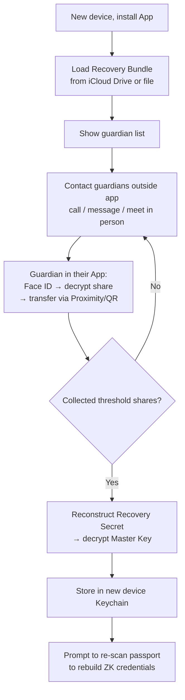

# Privacy & Security

Solidarity's privacy is designed at the base layer, not bolted on. Here's how data is protected, when Face ID is required, and how the trust level system works.

---

## All Data Stays On-Device

| Data Type | Storage | Encryption |
|-----------|---------|------------|
| DID Master Key + per-RP Keys | iOS Keychain (iCloud Keychain sync) | Hardware + Apple E2EE |
| Credentials (VC) | SwiftData (App sandbox) | iOS Data Protection |
| Contacts | SwiftData (App sandbox) | iOS Data Protection |
| ZK Proofs | SwiftData (App sandbox) | iOS Data Protection |
| Settings | UserDefaults | None (non-sensitive) |
| Recovery Bundle | iCloud Drive (non-Keychain) | AES-GCM + ECIES |

**Zero tracking**: No remote server records your sharing activity. No analytics. No telemetry. No accounts.

---

## Face ID Rules

Users never need to touch a private key, seed phrase, or any cryptographic detail. "Face ID is your identity."

### Operations that require Face ID

| Operation | Reason |
|-----------|--------|
| Save passport after scanning | Signing the credential |
| Face-to-face card exchange | Signing the exchange request |
| Present proof | Signing the VP token |
| Delete credential | Destructive operation |
| Export all data / social graph | High-sensitivity |
| Set up Social Recovery | Involves key backup |
| Guardian confirms recovery request | Releases Shamir share |

### Operations that don't require Face ID

| Operation | Reason |
|-----------|--------|
| Browse contacts | Low sensitivity |
| View credential details | Verified once at app launch |
| Change settings | Non-destructive |

**UI Handshake pattern**: Show an in-app confirmation screen (describing what's about to happen) *before* triggering the system Face ID prompt. Users never get a mysterious biometric request.

---

## Trust Level System

Every credential card must display trust level badge (color + text), trust anchor name, and verification method prominently.

| Level | Badge | Source | Verification |
|-------|-------|--------|--------------|
| **L3 — Government** | 🟢 | Passport NFC chip | ZKP (mopro) or NFC direct |
| **L2 — Institution** | 🔵 | Institution-issued VC (v2) | VC signature verification |
| **L1 — Self-issued** | ⚪ | Self-filled / Graph Credential | No third-party verification |

**Code**: `solidarity/Models/IdentityEntities.swift`

---

## Zero-Knowledge Proofs (ZKP)

Passport ZKP lets you prove to anyone — without revealing passport data — that you:

- Are **18+** (without disclosing date of birth)
- Are a **real human** (without disclosing name, nationality, or passport number)

Technical path: OpenPassport Noir circuit + mopro (on-device, 5-15 seconds). See [Zero-Knowledge Proofs architecture](/architecture/zero-knowledge) for details.

---

## Pairwise DID (Per-Verifier Isolation)

Each verifier (RP) gets an independent key pair — they cannot correlate users across services:

```
Keychain
  ├─ "solidarity.master"         → did:key (VC issuance, face-to-face exchange)
  ├─ "solidarity.rp.bar-abc.com" → did:key (proof presentation to Bar ABC)
  └─ "solidarity.rp.example.com" → did:key (login to example.com)
```

Each RP sees a different DID. Cross-RP correlation is impossible by design.

---

## Social Recovery (Shamir Secret Sharing)

### Concept

Shamir's Secret Sharing splits the DID Master Key recovery secret into N shares, each encrypted for a guardian. In a disaster, collecting `threshold` guardian confirmations reconstructs the key.

**Prerequisite**: at least 5 face-to-face verified contacts.

### Setup Flow [SR-1]

1. App recommends 5 verified contacts as guardians (adjustable, 3–7)
2. Confirm guardian list + threshold ("5 guardians, 3 needed to recover")
3. Face ID confirm

System actions (invisible):
- Generate Recovery Secret (256-bit random)
- Shamir SSS: split into N shares, threshold = ⌈N/2⌉+1
- Encrypt each share with guardian's DID public key (ECIES)
- AES-GCM encrypt Master Key backup with Recovery Secret
- Bundle → iCloud Drive

**Guardian design**: guardians don't need to pre-consent; guardians don't know each other's identities; Recovery Secret itself is never stored anywhere.

### Recovery Flow [SR-2]



### Security Analysis

| Attack Scenario | Defense |
|----------------|---------|
| Guardian collusion | Threshold design + guardians don't know each other |
| Recovery Bundle leaked | Shares are encrypted with guardian public keys |
| Guardian device stolen | Each share requires Face ID to access |
| Guardian unreachable | Threshold allows partial guardian failure; update list periodically |

**Code**:
- `solidarity/Services/Recovery/`
- `solidarity/Views/SettingsViews/` (Social Recovery settings)
