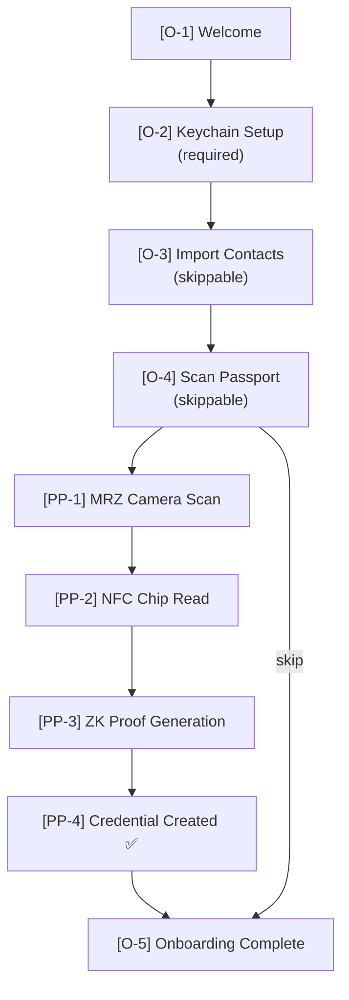
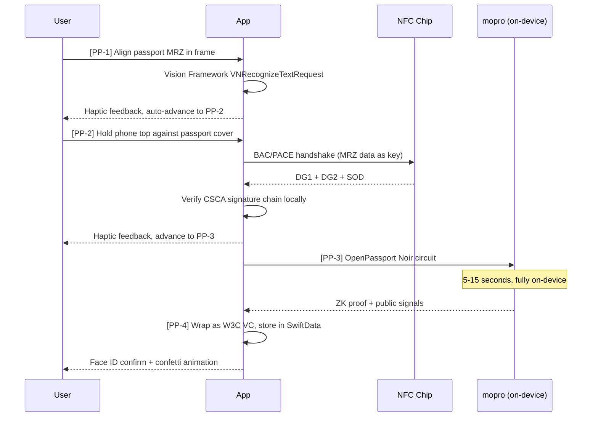

# Quick Start

**Goal**: Get users a credential and contact list within 3 minutes.



---

## Journey 1: Onboarding Screens

### [O-1] Welcome Screen

```
┌──────────────────────────────────┐
│      [Solidarity Logo]           │
│                                  │
│   Identity, with warmth          │
│                                  │
│         [Get Started]            │
└──────────────────────────────────┘
```

Tap [Get Started] → [O-2]

---

### [O-2] Keychain Setup (Required)

The app generates an EC P-256 key pair in iOS Keychain as the DID master key. What the user sees:

```
┌──────────────────────────────────┐
│   Create Your Digital Identity   │
│                                  │
│   Solidarity will create a       │
│   private key on your device,    │
│   protected by Face ID.          │
│                                  │
│   [System Face ID prompt]        │
└──────────────────────────────────┘
```

**System behavior (invisible to user)**:
1. `SecKeyCreateRandomKey` generates EC P-256 key pair
2. `kSecAttrAccessControl: .biometryCurrentSet` — Face ID protection
3. `kSecAttrAccessibleWhenUnlocked` — allows iCloud Keychain sync
4. Public key → `did:key` identifier

**Code**: `solidarity/Views/Onboarding/`, `solidarity/Services/Identity/`

---

### [O-3] Import Contacts (Skippable)

```
┌──────────────────────────────────┐
│   Import your phone contacts     │
│   so your list isn't empty       │
│                                  │
│   Imported contacts are never    │
│   uploaded to any server         │
│                                  │
│   [Import Contacts]  [Skip]      │
└──────────────────────────────────┘
```

Uses system `CNContactPickerViewController` for permission and contact selection.

---

### [O-4] Scan Passport Prompt (Skippable)

```
┌──────────────────────────────────┐
│   Scan your passport to unlock   │
│   your digital identity          │
│                                  │
│   Prove your age or humanhood    │
│   without revealing other info   │
│                                  │
│   [illustration: passport + NFC] │
│                                  │
│   [Scan Passport]   [Skip]       │
└──────────────────────────────────┘
```

Tap [Scan Passport] → Journey 1a Passport Scan sub-flow.

---

### [O-5] Onboarding Complete

Dynamically shown based on completion:

| Status | Display |
|--------|---------|
| Passport + Contacts | ✅ N contacts imported · ✅ Passport identity created |
| Passport only | ✅ Passport identity created · 💡 Recommend importing contacts |
| Contacts only | ✅ N contacts imported · 💡 Recommend scanning passport |
| Neither | Setup complete, add anytime |

CTA: [Start Exploring] → People Tab (if contacts exist) or Me Tab (if not)

---

## Journey 1a: Passport Scan Sub-flow

**Entry points**: [O-4] or Me Tab → Add Credential → Scan Passport



### [PP-1] MRZ Camera Scan

```
┌──────────────────────────────────┐
│   [Full-screen camera]           │
│                                  │
│   ┌──────────────────────────┐   │
│   │   Passport MRZ frame     │   │
│   └──────────────────────────┘   │
│                                  │
│   Place passport data page       │
│   inside the frame               │
└──────────────────────────────────┘
```

Technology: Vision Framework `VNRecognizeTextRequest` to recognize MRZ codes.

**Code**: `solidarity/Services/Identity/NFCPassportReaderService.swift`

---

### [PP-2] NFC Chip Read

```
┌──────────────────────────────────┐
│   [Passport + NFC animation]     │
│   Hold phone top against         │
│   the passport cover             │
│   Reading... [progress indicator]│
└──────────────────────────────────┘
```

Technology:
1. MRZ data as BAC/PACE access key
2. Read DG1 (MRZ), DG2 (facial image), SOD (Security Object Document)
3. Verify CSCA signature chain locally (Document Signer → Country Signer → Root)

**Code**: `solidarity/Services/Identity/PassportPipelineService.swift`

Failure cases:
- NFC interrupted → "Read interrupted, please hold passport steady" + [Retry]
- CSCA verification failed → "Cannot verify passport signature, your passport may not be in the supported list"

---

### [PP-3] ZK Proof Generation

```
┌──────────────────────────────────┐
│   Generating your zero-knowledge │
│   identity...                    │
│   [Progress animation, ~5-15s]   │
│                                  │
│   This runs entirely on your     │
│   device. No data leaves.        │
└──────────────────────────────────┘
```

Technology:
1. Passport SOD fed into OpenPassport Noir circuit
2. mopro runs ZK prover on-device
3. Output: ZK proof + public signals (age ≥ 18, is_human, derived claims)
4. Wrapped as self-issued W3C VC

**Code**: `solidarity/Services/ZK/MoproProofService.swift`

**ZKP Fallback**: If ZK proof fails → fall back to SD-JWT selective disclosure. Trust badge shows "NFC Verified" instead of "ZKP Verified".

---

### [PP-4] Passport Credential Created ✅

```
┌──────────────────────────────────┐
│   [Confetti animation]           │
│                                  │
│   🛂 Passport Identity Created   │
│   🟢 Trust: [Country] MFA        │
│        ZKP Verified ✓            │
│                                  │
│   You can now:                   │
│   → Prove you're 18+ (no DOB)    │
│   → Prove you're human (no PII)  │
│                                  │
│   [Done]                         │
└──────────────────────────────────┘
```

The generated VC is stored in SwiftData and appears in Me Tab under "What I can prove".
