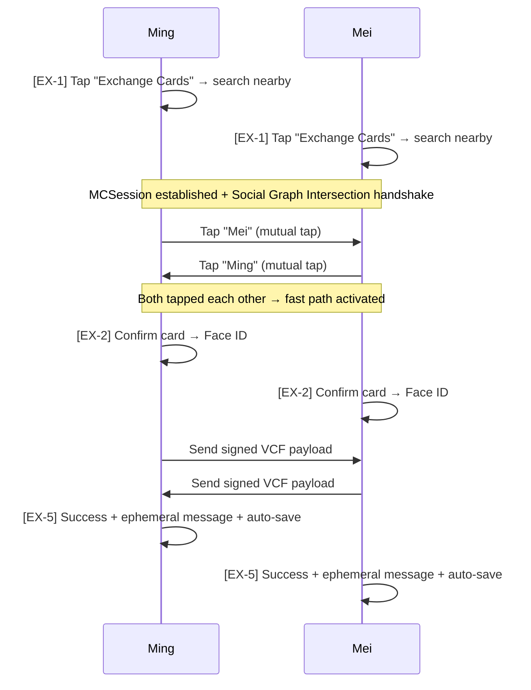
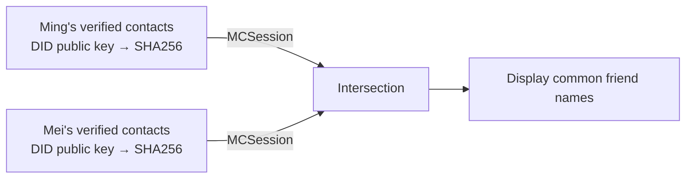

# Face-to-Face Card Exchange

**Journey 2: Face-to-Face Exchange**

Discover nearby Solidarity users via Bluetooth (MultipeerConnectivity), exchange cryptographically signed cards, and leave each other an ephemeral message.

**Prerequisite**: Both parties have Solidarity installed.
**Design goal**: Face-to-face exchange should feel as fast as AirDrop. Happy path: 3 steps — Discovery → Confirm → Success.

---

## Parallel Timeline for Both Parties



> **Mutual tap vs request path**: If **both parties tap each other**, skip directly to EX-2 — no request/accept roundtrip needed. If **only one party taps**, follow the EX-3/EX-4 request path.

---

## Screen Details

### [EX-1] Discovery

```
┌──────────────────────────────────────────┐
│  Searching for nearby Solidarity users   │
│                                          │
│         [Radar scan animation]           │
│                                          │
│  ─── Nearby ─────────────────────────   │
│  ┌──────────────────────────────────┐   │
│  │ 👤 Mei          👥 3 common friends│   │
│  ├──────────────────────────────────┤   │
│  │ 👤 Bob                           │   │
│  └──────────────────────────────────┘   │
│                                          │
│  [Stop Searching]                        │
└──────────────────────────────────────────┘
```

**Technical flow**:
1. Start `MCNearbyServiceAdvertiser + MCNearbyServiceBrowser`
2. On discovery, perform **Graph Intersection handshake**:
   - Both sides SHA256-hash their verified contacts' DID public keys
   - Exchange hash sets via MCSession
   - Compute intersection locally → look up contact names
3. On tap:
   - IF mutual tap → directly to [EX-2]
   - IF only one side taps → [EX-3] (send request)

**Edge cases**:
- Bluetooth off → "Please enable Bluetooth" + [Settings]
- 30s timeout → "No Solidarity users found nearby" + [Try Again]

**Code**:
- [`solidarity/Views/MatchViews/MatchingView.swift`](https://github.com/p2p-solidarity/solidarity/blob/main/solidarity/Views/MatchViews/MatchingView.swift)
- [`solidarity/Services/Sharing/ProximityManager.swift`](https://github.com/p2p-solidarity/solidarity/blob/main/solidarity/Services/Sharing/ProximityManager.swift)
- [`solidarity/Services/SocialGraph/`](https://github.com/p2p-solidarity/solidarity/tree/main/solidarity/Services/SocialGraph)

---

### [EX-2] Confirm Card (One-Glance Confirm)

```
┌──────────────────────────────────────────┐
│  Exchange Cards                   [Cancel]│
├──────────────────────────────────────────┤
│  👥 You and Mei have 3 common friends:   │
│     Bob, Alice, Charlie                  │
├─ Your Card ────────────────────────────┤
│  Ming                                    │
│  Acme Corp · Engineer                    │
│  ming@acme.com                           │
│                          [Edit Card ✎]   │
├──────────────────────────────────────────┤
│  [Exchange with Face ID]  ← primary CTA  │
└──────────────────────────────────────────┘
```

**Design**:
- Shows the pre-configured card from Settings — no field selection needed per exchange
- [Edit Card ✎] expands field checklist (rare use)
- One CTA, one Face ID, done

**Code**: [`solidarity/Views/MatchViews/ConnectPeerPopupView.swift`](https://github.com/p2p-solidarity/solidarity/blob/main/solidarity/Views/MatchViews/ConnectPeerPopupView.swift), [`solidarity/Views/MatchViews/ShareCardPickerSheet.swift`](https://github.com/p2p-solidarity/solidarity/blob/main/solidarity/Views/MatchViews/ShareCardPickerSheet.swift)

---

### [EX-3] Waiting (Initiator — non-mutual-tap only)

```
┌──────────────────────────────────────────┐
│         [Pulse animation]                │
│     Exchange request sent to Mei         │
│     Waiting for response...              │
│     [Cancel Request]                     │
└──────────────────────────────────────────┘
```

Accepted → [EX-5] | Declined → back to [EX-1] | Timeout 60s → "Request timed out"

---

### [EX-4] Receive Request (Responder — non-mutual-tap only)

Triggered:
- **In Discovery** → in-app modal
- **In other screens** → top banner
- **App backgrounded** → push notification

Tap [Accept →] → [EX-2] (confirm your own card) → Face ID → [EX-5]

---

### [EX-5] Exchange Success ✅ + Ephemeral Message + Auto-Save

```
┌──────────────────────────────────────────┐
│   [Confetti + Haptic .success]           │
│                                          │
│   ✅ Card exchanged with Mei             │
│                                          │
│  ┌─ Mei's Card ───────────────────┐      │
│  │ 👤 Mei         ✅ Verified     │      │
│  │    Sprout Labs · Designer      │      │
│  │    mei@sprout.tw               │      │
│  │    👥 3 common friends         │      │
│  └─────────────────────────────────┘     │
│                                          │
│  ┌─ Ephemeral Message ────────────┐      │
│  │ Write a note to Mei... (140)   │      │
│  │                       [Send]   │      │
│  └─────────────────────────────────┘     │
│  ─── Their message ─────────────────     │
│  (Waiting... / shows real-time)          │
│                                          │
│  [Done]                                  │
└──────────────────────────────────────────┘
```

**Ephemeral message UX**:
- Text field is expanded by default (encourage writing)
- Other party not written yet → dim "Waiting..."
- Other party written → slide-in animation + Haptic .light
- After [Send]: locked, cannot modify

**Auto-save** (replaces old EX-6):
- On success, automatically saved to Contact store
- If contact already exists → inline dialog: "Merge with existing Mei? → [Merge] [Add Separately]"
- Tap [Done] → back to People Tab, new contact at top + 3s highlight

**Technical payload**:

```swift
// solidarity/Services/Sharing/ProximityPayload.swift
struct ProximityPayload: Codable {
    let cardFields: [String: String]    // filtered card fields
    let senderDID: String               // did:key:z6Mk...
    let timestamp: Date
    let issuerCommitment: String?
    let issuerProof: Data?
    let sdProof: Data?
    let payloadSignature: Data          // ECDSA P-256 signature
    let sealedRoute: Data?
    let pubKey: Data?
    let signPubKey: Data?
}
```

**Code**:
- [`solidarity/Services/Sharing/ProximityManager+SessionDelegate.swift`](https://github.com/p2p-solidarity/solidarity/blob/main/solidarity/Services/Sharing/ProximityManager+SessionDelegate.swift)
- [`solidarity/Services/Sharing/ProximityPayload.swift`](https://github.com/p2p-solidarity/solidarity/blob/main/solidarity/Services/Sharing/ProximityPayload.swift)

---

## Default Card Configuration

Users pre-configure which fields to include in Me Tab or Settings → Sharing. No per-exchange field selection needed.

**Code**: [`solidarity/Views/SettingsViews/SelectiveDisclosureSettingsView.swift`](https://github.com/p2p-solidarity/solidarity/blob/main/solidarity/Views/SettingsViews/SelectiveDisclosureSettingsView.swift)

---

## Social Graph Intersection (Common Friends)

**Privacy design**: only SHA256 hashes are exchanged — neither party can infer the other's full contact list.



**Code**: [`solidarity/Services/SocialGraph/`](https://github.com/p2p-solidarity/solidarity/tree/main/solidarity/Services/SocialGraph)
