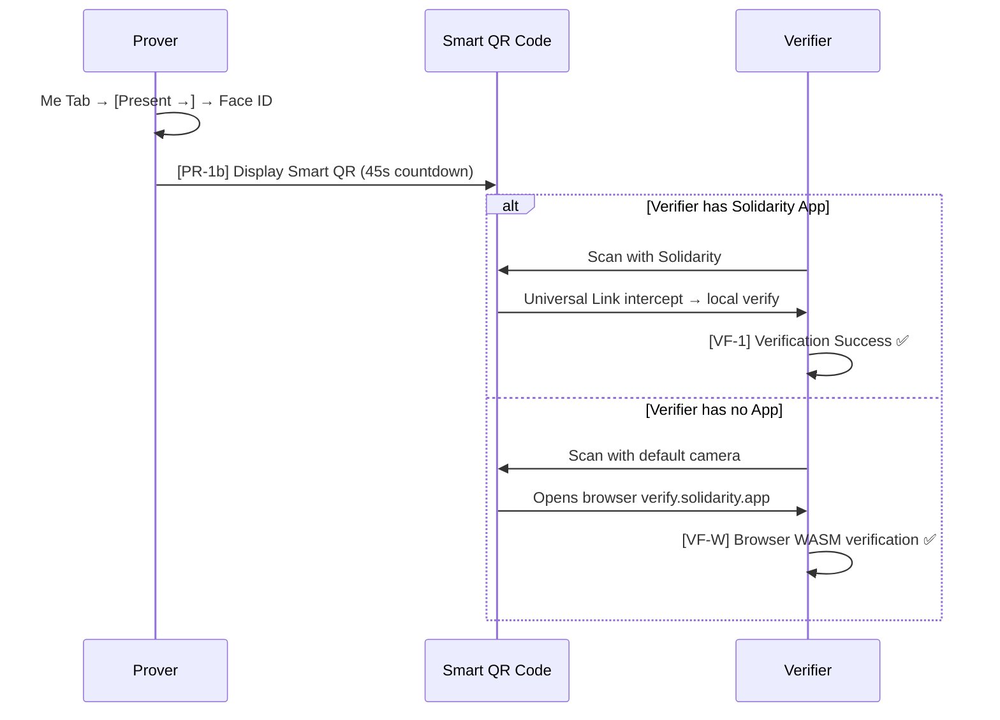

# Present ZKP Proof

**Journey 3: Present Proof to Verifier**

Present passport-derived zero-knowledge proofs (age ≥ 18, humanhood) to verifiers. Supports two paths:

- **Path 1 — App-to-App**: verifier has Solidarity → scan QR, verify locally, < 1s, no network
- **Path 2 — Web Verifier**: verifier has no app → scan QR → opens self-hosted webpage, browser-side WASM verification

---

## Parallel Timeline



---

## Prover Side

### Entry Point A: Self-initiated (Me Tab)

Me Tab → tap **[Present →]** on a proof → Face ID → [PR-1b]

### Entry Point B: Passive (scan Verifier's QR)

Share Tab → [📷 Scan] → scan `openid4vp://` QR → [SC-2] Router → [PR-1]

---

### [PR-1] Proof Request Review (triggered from Verifier QR)

```
┌─────────────────────────────────┐
│  Bar ABC requests confirmation: │
│                                 │
│  ✅ You are 18+                  │
│                                 │
│  Not shared:                    │
│  ✕ Name                         │
│  ✕ Date of birth                │
│  ✕ Passport number              │
│                                 │
│  Source: Passport · 🟢 Gov-level │
│                                 │
│  [Decline]  [Present with Face ID]│
└─────────────────────────────────┘
```

Technology: parse OID4VP `presentation_definition`, search local credential store for matching VCs.

---

### [PR-1b] Self-Initiated QR Display

```
┌──────────────────────────────────────────┐
│                                          │
│  🟢 Age ≥ 18                             │
│                                          │
│       ┌──────────────────────┐           │
│       │                      │           │
│       │    [Smart QR Code]   │           │
│       │                      │           │
│       └──────────────────────┘           │
│                                          │
│  Not revealed: name, DOB, passport no.   │
│                                          │
│  ⏱ [Circular progress] 45s remaining    │
│                                          │
│  [Close]                                 │
└──────────────────────────────────────────┘
```

**Countdown expires** → auto re-sign and refresh QR + toast "QR Code refreshed"

**Smart QR design (one QR, two paths, zero decision)**:

```
QR content = https://verify.solidarity.app/p/{proof_id}#{signed_vp_token}
```

| Verifier situation | Behavior |
|-------------------|----------|
| Has Solidarity App | App intercepts as Universal Link, extracts VP token from fragment → local verify |
| No App (default camera) | Opens browser, extracts proof from URL fragment → WASM verify |

**Privacy**: proof is in the URL fragment (`#`), server never sees it. Prover doesn't need to know if verifier has the app.

**Code**:
- `solidarity/Views/ScanViews/ProofPresentationFlowSheet.swift`
- `solidarity/Services/Identity/OID4VPPresentationService.swift`

---

### [PR-2] Proof Signing & Submission

```
Generating and submitting proof... (1-3s)
```

Technology:
1. Face ID unlocks Keychain
2. Use pairwise DID key for this verifier's domain (creates new per-RP key pair if needed)
3. Sign `vp_token` with pairwise DID key (ECDSA P-256)
4. Submit to verifier via OID4VP `redirect_uri`

---

### [PR-3] Proof Presented ✅

```
[Green checkmark animation]
Proof submitted ✅
The verifier can confirm you're 18+,
but sees none of your other information.
```

Auto-closes after 3 seconds.

---

## Verifier Side (In-App)

### [VF-1] Verification Success ✅

```
┌──────────────────────────────────────────┐
│                                          │
│       [Green shield ✅ zoom-in]          │
│                                          │
│       This person is an adult            │
│       Age ≥ 18                           │
│                                          │
│  ── Verification Details ──────────      │
│  Source: Passport · 🟢 ZKP Verified      │
│  Signed: 2025-03-15 14:30               │
│  ⚠️ This proof doesn't include name      │
│                                          │
│  [Done]                                  │
└──────────────────────────────────────────┘
```

**Plain-language headline** (not just technical fields):

| Proof Type | Headline |
|-----------|---------|
| `age_over_18` | This person is an adult (Age ≥ 18) |
| `is_human` | This person is a real human (Passport verified) |
| `verified_contact_count` | This person has N face-to-face verified contacts |

**Verification speed**: < 1s — skip loading screen, animate directly to result.

---

### [VF-1c] Verification Failed ❌

```
┌──────────────────────────────────────────┐
│   [Red shield ❌ + Haptic .error]        │
│                                          │
│   Verification Failed                    │
│                                          │
│   IF expired / replay attack:            │
│     "Expired. Ask them to present again" │
│                                          │
│   IF other (invalid sig / bad format):  │
│     "This proof cannot be verified"      │
│                                          │
│   [Scan Again]    [Close]                │
└──────────────────────────────────────────┘
```

**Technical verification (in-app)**:
1. Parse VP token (compact JWT)
2. Verify ZK proof (mopro verifier)
3. Check nonce + expiry (replay prevention)
4. Extract public signals

**Code**:
- `solidarity/Services/Identity/ProofVerifierService.swift`
- `solidarity/Services/Identity/ProofVerifierService+VPToken.swift`

---

## Verifier Side (Web — No App)

### [VF-W] Web Verifier

Triggered: default camera scans Smart QR → opens `verify.solidarity.app` in browser

```
┌──────────────────────────────────────────┐
│  [Solidarity Logo]                       │
│                                          │
│       ✅ This person is an adult         │
│       Age ≥ 18                           │
│                                          │
│  Source: Passport · 🟢 ZKP Verified      │
│                                          │
│  This proof doesn't include name or      │
│  any other personal information.         │
│  ─────────────────────                   │
│  What is a zero-knowledge proof?         │
│  The person used their passport to       │
│  generate a mathematical proof that      │
│  they're 18+, revealing nothing else.   │
│  ─────────────────────                   │
│  [Download Solidarity App]               │
└──────────────────────────────────────────┘
```

**Technology**:
- Self-hosted static web + WASM ZK verifier (snarkjs or mopro-wasm)
- Proof is in URL fragment → server never sees it (server-side privacy)
- Verification logic runs in browser
- iOS App Clip: Universal Link can trigger App Clip for native experience

---

## VP Token Structure (OID4VP)

```json
{
  "iss": "did:key:z6Mk...",
  "iat": 1710000000,
  "exp": 1710000045,
  "nonce": "verifier-provided-nonce",
  "aud": "https://bar-abc.example.com",
  "vp": {
    "@context": ["https://www.w3.org/2018/credentials/v1"],
    "type": ["VerifiablePresentation"],
    "holder": "did:key:z6Mk...",
    "verifiableCredential": [
      "eyJhbGciOiJFUzI1NiIsInR5cCI6IkpXVCJ9..."
    ]
  }
}
```

A single VP can carry multiple VC JWTs.

**Code**: `solidarity/Services/Identity/OID4VPPresentationService.swift` (`wrapCredentialsAsVP`)
